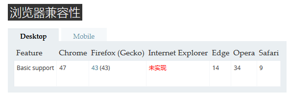
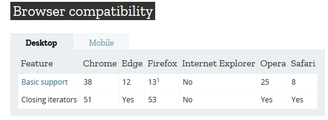

#### 1.Array.prototype.includes() [链接](https://developer.mozilla.org/zh-CN/docs/Web/JavaScript/Reference/Global_Objects/Array/includes)
判断数组中是否包含一个指定的值，includes具有兼容性问题，IE并未实现，其他浏览器低版本也未实现。 

#### 2.for...of [链接](https://developer.mozilla.org/en-US/docs/Web/JavaScript/Reference/Statements/for...of)
ie不支持数组的for...of 

