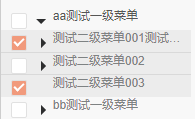
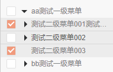

*这里将会记录一些碰到bug、兼容性问题、小技巧等内容*

#### 1. css background-img :hover 状态下切换背景图片会闪烁一下的问题：
[链接](http://www.jb51.net/css/234744.html)

- 成因：第一次hover时，会去服务器请求图片，故此可能会造成闪烁；
- 解决：
    1. 预先加载；
    2. 将hover前后两张图片做成一张，靠`background-position`来控制图片位置 

---

#### 2. 设置 inline-block元素的overflow:hidden，导致相邻行内元素向下偏移
[链接](http://blog.csdn.net/cmlddcml/article/details/52798565)

图例：

- 原因：当一个inline-block元素被设置overflow非visible属性值后，其baseline将被强制修改为元素下外边沿。
- 解决：1.为inline-block元素添加 `vertical-align:bottom|middle`；2.将inline-block设为`block`。

--- 

#### 3. 对于UEditor视频上传后，重新读把内容放在编辑器编辑/预览，video的src为unknown的情况
[帖子](http://bbs.csdn.net/topics/391963518)
ueditor.config.js 365hang ,`whiteList`拼错了

#### 4. UEditor常见问题
[链接](http://ueditor.baidu.com/website/helper.html)