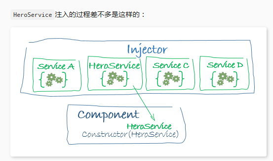

### 一、架构概览

用`Angular拓展语法`编写HTML模板，用`组件类`管理这些模板，用`服务`添加应用逻辑，用`模块`打包发布组件与服务。

#### Angular模块（无论根模块还是特性模块），都是一个带有@NgModule装饰器的类
NgModule是一个装饰器函数，接收一个用来描述模块属性的元数据对象。最重要的属性：
- declarations：声明本模块中拥有的视图类。`组件`,`指令`,`管道`；（声明一下这个模块内部成员）。
- exports：declarations的子集，可用于其他模块的组件模板。用来控制将哪些内部成员暴露给外部使用。导入一个module并不意味着将会导入这个module内部导入的module所暴露出的公共成员，除非导入的这个module把它内部导入的module写到exports中。
- imports：本模块声明的组件模板需要的类所在的其他模块。导入其他module，其他module暴露的Components、Directives、Pipes等可以在本module的组件中被使用。
- providers：服务的创建者，并加入到全局服务列表中，可用于应用任何部分。
- bootstrap：指定应用的主视图（称为根组件），它是所有其他视图的宿主。`只有根模块`才能设置bootstrap属性。

我们通过引导根模块来启动应用，在开发期间，通常在一个main.ts文件中引导AppModule，
```
import { enableProdMode } from '@angular/core';
import { platformBrowserDynamic } from '@angular/platform-browser-dynamic';

import { AppModule } from './app/app.module';
import { environment } from './environments/environment';

if (environment.production) {
  enableProdMode();
}

platformBrowserDynamic().bootstrapModule(AppModule);
```

#### 依赖注入（injector）
依赖注入式提供类的新实例的一种方式，还负责处理好类所需的全部依赖。大多数依赖都是服务，angular使用依赖注入来提供新组件以及组件所需的服务。

当angular创建组件时，会首先为组件所需的服务请求一个注入器。

```
constructor(private service: HeroService) { }
```
服务注入过程：


如果注入器还没有服务，我们必须先用注入器为服务注册要给提供商（provider），提供商用来创建或返回服务，通常就是这个服务类本身。

通常会把提供商添加到根模块上，以便在任何地方都使用服务的同一个实例；或者也可以在@Component元数据中providers属性中把它注册在组件层。
```
app.module.ts

providers: [
  BackendService,
  HeroService,
  Logger
],

xx.component.ts

@Component({
  selector:    'app-hero-list',
  templateUrl: './hero-list.component.html',
  providers:  [ HeroService ]
})
```

把它注册在组件级表示该组件的每一个新实例都会有一个服务的新实例。

关于依赖注入的要点：
- 依赖注入渗透在整个angular框架中，被到处使用。
- 注入器是本机制的核心：1. 注入器负责维护一个容器，用于存放他创建过的服务实力；2. 注入器能使用提供商创建一个新的服务实例。
- 提供商是一个用于创建服务的配方。
- 把提供商注册到注入器。