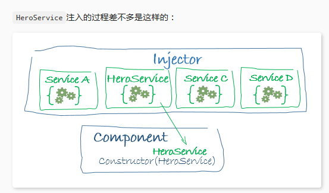

### 一、架构概览

用`Angular拓展语法`编写HTML模板，用`组件类`管理这些模板，用`服务`添加应用逻辑，用`模块`打包发布组件与服务。

#### Angular模块（无论根模块还是特性模块），都是一个带有@NgModule装饰器的类
NgModule是一个装饰器函数，接收一个用来描述模块属性的元数据对象。最重要的属性：
- declarations：声明本模块中拥有的视图类。`组件`,`指令`,`管道`；（声明一下这个模块内部成员）。
- exports：declarations的子集，可用于其他模块的组件模板。用来控制将哪些内部成员暴露给外部使用。导入一个module并不意味着将会导入这个module内部导入的module所暴露出的公共成员，除非导入的这个module把它内部导入的module写到exports中。
- imports：本模块声明的组件模板需要的类所在的其他模块。导入其他module，其他module暴露的Components、Directives、Pipes等可以在本module的组件中被使用。
- providers：服务的创建者，并加入到全局服务列表中，可用于应用任何部分。
- bootstrap：指定应用的主视图（称为根组件），它是所有其他视图的宿主。`只有根模块`才能设置bootstrap属性。

我们通过引导根模块来启动应用，在开发期间，通常在一个main.ts文件中引导AppModule，
```
import { enableProdMode } from '@angular/core';
import { platformBrowserDynamic } from '@angular/platform-browser-dynamic';

import { AppModule } from './app/app.module';
import { environment } from './environments/environment';

if (environment.production) {
  enableProdMode();
}

platformBrowserDynamic().bootstrapModule(AppModule);
```

#### 依赖注入（injector）
依赖注入式提供类的新实例的一种方式，还负责处理好类所需的全部依赖。大多数依赖都是服务，angular使用依赖注入来提供新组件以及组件所需的服务。

当angular创建组件时，会首先为组件所需的服务请求一个注入器。

```
constructor(private service: HeroService) { }
```
服务注入过程：


如果注入器还没有服务，我们必须先用注入器为服务注册要给提供商（provider），提供商用来创建或返回服务，通常就是这个服务类本身。

通常会把提供商添加到根模块上，以便在任何地方都使用服务的同一个实例；或者也可以在@Component元数据中providers属性中把它注册在组件层。
```
app.module.ts

providers: [
  BackendService,
  HeroService,
  Logger
],

xx.component.ts

@Component({
  selector:    'app-hero-list',
  templateUrl: './hero-list.component.html',
  providers:  [ HeroService ]
})
```

把它注册在组件级表示该组件的每一个新实例都会有一个服务的新实例。

关于依赖注入的要点：
- 依赖注入渗透在整个angular框架中，被到处使用。
- 注入器是本机制的核心：1. 注入器负责维护一个容器，用于存放他创建过的服务实力；2. 注入器能使用提供商创建一个新的服务实例。
- 提供商是一个用于创建服务的配方。
- 把提供商注册到注入器。

### 二、[词汇表](https://angular.cn/guide/glossary)

#### 装饰器（decorator|decoration）
装饰器是要给函数，它将元数据添加到类、类成员（属性、方法）和函数参数。

要想应用装饰器，把它放到被装饰对象的上面或左边。

```
@Component({
  selector: 's-project',
  templateUrl: './project.component.html',
  styleUrls: ['./project.component.scss']
})
export class AppComponent {
  constructor(@Inject('SpecialFoo') public foo:Foo) {}
  @Input() name:string;
}
```

用@Component装饰器来讲一个类标记为Angular组件，并将@Input装饰器来应用到组件的name属性。@Component装饰器中的参数对象包含与组件有关的元数据。

装饰器的作用域会被限制在它所装饰的语言特性，在同一文件中，装饰器不会泄露到他后面的其他类。

#### 指令（directive）
指令是一个angular类，负责创建和重塑浏览器DOM中的html元素，并与之互动。指令是Angular中最基本的特性之一。

指令分为三类：
1. 组件（component）：用于组合程序逻辑和HTML模板，渲染出应用程序的视图。
2. 属性型指令（attribute directive）：可以监控和修改其他HTML元素、HTML属性（attribute）、DOM属性（property）、组件等行为等等。他们通常表示为HTML属性。
3. 结构型指令（structural directive）：负责塑造或重塑HTML布局，一般是通过添加、删除或操作HTML元素及其子元素来实现的。

### 核心知识
#### 模板与数据绑定
##### 组件交互
##### 1.通过setter截听输入属性值的变化
使用一个输入属性的setter，以拦截父组件中值的变化，并采取行动。
```
private _name='';
@Input()
set name(name:string){
  this._name = (name && name.trim()) || '<no name set>';
}
get name():string{return this._namel;}
```

##### 2.通过ngOnChanges（）来截听输入属性值的变化
当需要监视多个、交互式输入属性的时候，本方法比属性的setter更合适。

知识点：`SimpleChange`

##### 3.父组件监听子组件的事件
子组件暴露一个`EventEmitter`属性，当事件发生时，子组件利用该属性`emits`（向上弹射）事件。父组件绑定到这个事件属性，并在事件发生时做出回应。

子组件的`EventEmitter`属性是一个输出属性，通常带有`@Output装饰器`。

父组件绑定一个事件处理器，用来响应子组件的事件并更新。
```
app-voter


    import { Component, EventEmitter, Input, Output } from '@angular/core';
     
    @Component({
      selector: 'app-voter',
      template: `
        <h4>{{name}}</h4>
        <button (click)="vote(true)"  [disabled]="voted">Agree</button>
        <button (click)="vote(false)" [disabled]="voted">Disagree</button>
      `
    })
    export class VoterComponent {
      @Input()  name: string;
      @Output() onVoted = new EventEmitter<boolean>();
      voted = false;
     
      vote(agreed: boolean) {
        this.onVoted.emit(agreed);
        this.voted = true;
      }
    }


app-vote-taker


    import { Component }      from '@angular/core';
     
    @Component({
      selector: 'app-vote-taker',
      template: `
        <h2>Should mankind colonize the Universe?</h2>
        <h3>Agree: {{agreed}}, Disagree: {{disagreed}}</h3>
        <app-voter *ngFor="let voter of voters"
          [name]="voter"
          (onVoted)="onVoted($event)">
        </app-voter>
      `
    })
    export class VoteTakerComponent {
      agreed = 0;
      disagreed = 0;
      voters = ['Mr. IQ', 'Ms. Universe', 'Bombasto'];
     
      onVoted(agreed: boolean) {
        agreed ? this.agreed++ : this.disagreed++;
      }
    }
```

##### 4.父组件与子组件通过本地变量互动
父组件不能使用数据绑定来读取子组件的属性或调用子组件的方法。但可以在父组件模板里，新建一个本地变量来代表子组件，然后利用这个变量来读取子组件的属性和调用子组件的方法。
```
app-countdown-timer

  seconds = 11;
  start() { this.countDown(); }
  stop()  {
    this.clearTimer();
    this.message = `Holding at T-${this.seconds} seconds`;
  }
 
  private countDown() {
    ...
  }


app-countdown-parent-lv

  <button (click)="timer.start()">Start</button>
  <button (click)="timer.stop()">Stop</button>
  <div class="seconds">{{timer.seconds}}</div>
  <app-countdown-timer #timer></app-countdown-timer>
```

有一定局限性，因为父组件-子组件的连接必须全部在父组件的模板中进行，父组件本身的代码对子组件没有访问权。

##### 5.父组件调用@ViewChild()
当父组件类需要读取子组件的属性值或调用子组件的方法，可以把子组件作为ViewChild，注入到父组件里面。
```
    import { AfterViewInit, ViewChild } from '@angular/core';
    import { Component }                from '@angular/core';
    import { CountdownTimerComponent }  from './countdown-timer.component';
     
    @Component({
      selector: 'app-countdown-parent-vc',
      template: `
      <h3>Countdown to Liftoff (via ViewChild)</h3>
      <button (click)="start()">Start</button>
      <button (click)="stop()">Stop</button>
      <div class="seconds">{{ seconds() }}</div>
      <app-countdown-timer></app-countdown-timer>
      `,
      styleUrls: ['../assets/demo.css']
    })
    export class CountdownViewChildParentComponent implements AfterViewInit {
     
      @ViewChild(CountdownTimerComponent)
      private timerComponent: CountdownTimerComponent;
     
      seconds() { return 0; }
     
      ngAfterViewInit() {
        setTimeout(() => this.seconds = () => this.timerComponent.seconds, 0);
      }
     
      start() { this.timerComponent.start(); }
      stop() { this.timerComponent.stop(); }
    }
```
首先，使用ViewChild装饰器导入这个引用；然后，通过@ViewChild属性装饰器，将子组件CountdownTimerComponent注入到私有属性timerComponent里面。

##### 6.父组件和子组件通过服务来通讯
