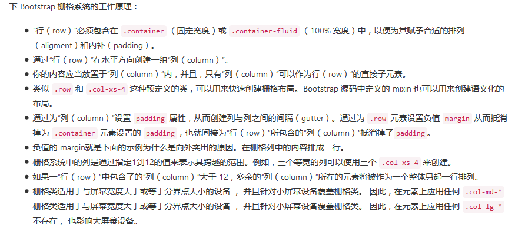
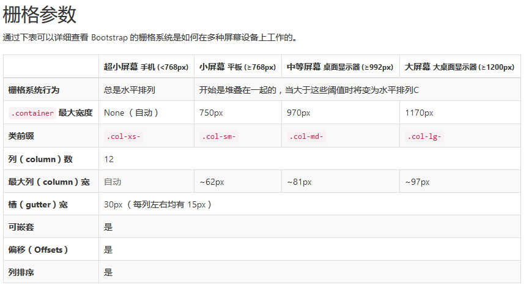
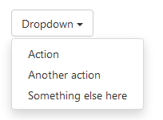

## Bootstrap初级带入门  --*试水版*

当我们开始使用一个框架或者一门语言时，都需要预先了解三件事：
1. 他是什么？
2. 他有什么？
3. 他能做什么？

本初级说明文档，不带算详细说明该如何用Bootstrap开发一个web项目，而是仅仅只说明以上三个问题。

--- 

### 一、他是什么？
> Bootstrap可以说是当下最受欢迎的`HTML、CSS和JS框架`，用于开发响应式布局、移动设备优先的WEB项目。

很明显Bootstrap是运用在前端的框架，他并不会关心数据业务层的处理，而是只专注于前端内容以及效果的展示。而Bootstrap的目的，就是让开发者能快速上手、适配所有设备。

---

### 三、他能做什么？

绕过Bootstrap有什么的问题，先了解他能做什么？
Bootstrap最大的特点就是`响应式设计`：他能最大限度的节省我们的CSS代码，快速完成各个设备上的布局工作；同时他为我们提供了`众多组件和插件`，让我们摆脱了原始的组件设计和头疼的兼容性工作，而只需要专注于自己特有的部分便可。

- 一个框架、多种设备：

    Bootstrap通过CSS媒体查询，能够让我们仅仅使用一份代码就能快速、有效适配手机、平板以及PC设备。

- 众多组件和插件、开发快速；

    Bootstrap为我们提供了众多的组件，也基于jQuery封装了众多的插件。我们可以简单的做到复用组件和引用插件，甚至可以不需要修改任何css代码便可构建出一个比较客观的WEB页面。

- 预处理脚本

    除了直接引用Bootstrap提供的CSS样式表之外，我们也可以采用预编译*Less和Sass*的CSS文件快速开发，当然，Bootstrap也为我们提供定制自己所需样式的服务。

---

### 二、他有什么？

Bootstrap有很多东西，大体可以分为四块：

    1. 布局（栅格系统）
    2. 基础样式
    3. 组件
    4. JavaScript插件

#### 1. [布局（栅格系统）](http://v3.bootcss.com/css/#grid)

> Bootstrap 提供了一套响应式、移动设备优先的流式栅格系统，随着屏幕或视口（viewport）尺寸的增加，系统会自动分为最多12列。

> 栅格系统用于通过一系列的行（row）与列（column）的组合来创建页面布局，你的内容就可以放入这些创建好的布局中。

- 基本用法 []



```
<div class="container">
  <div class="row">
    <div class="col-md-8">.col-md-8</div>
    ...
  </div>
</div>
```



#### 2. [基本样式](http://v3.bootcss.com/css/#type)

Bootstrap为了增强跨浏览器表现的一致性，已经使用了CSS重置样式表，所以我们可以放心的直接使用各种标签，不用担心各自浏览器默认的样式。

同时，Bootstrap也为我们提供了非常多的HTML元素基础样式，包括文字排版、代码、表格、表单、按钮、图片、字体|背景颜色、浮动以及[响应式工具](http://v3.bootcss.com/css/#responsive-utilities)等等，基本已经满足了我们开发的需求了。

#### 3. [组件](http://v3.bootcss.com/components/)

Bootstrap提供了很多可复用的组件，包括字体图标、下拉菜单、按钮组、分页、路径导航等。

我们只需要在html中写入对应的标签，然后加上Bootstrap提供的class类，即可使用比较完美并且成熟的组件了，而不需要我们额外添加任何css/js代码来构成组件。

example:
```
<div class="dropdown">
  <button class="btn btn-default dropdown-toggle" type="button" id="dropdownMenu1" data-toggle="dropdown" aria-haspopup="true" aria-expanded="true">
    Dropdown
    <span class="caret"></span>
  </button>
  <ul class="dropdown-menu" aria-labelledby="dropdownMenu1">
    <li><a href="#">Action</a></li>
    <li><a href="#">Another action</a></li>
    <li><a href="#">Something else here</a></li>
    <li role="separator" class="divider"></li>
    <li><a href="#">Separated link</a></li>
  </ul>
</div>
```


#### 4. [JavaScript插件](http://v3.bootcss.com/javascript/)

Bootstrap基于jQuery为我们封装了很多插件，像常用的模态框、标签页、弹出框等。

Bootstrap插件有两种使用方式:

- data属性

> 你可以`仅仅通过 data 属性 API 就能使用所有的 Bootstrap 插件，无需写一行 JavaScript 代码。这是 Bootstrap 中的一等 API，也应该是你的首选方式。

通过 `$(document).off('.data-api')` 来解除绑定事件.

- API

> 我们为所有 Bootstrap 插件提供了纯 JavaScript 方式的 API。所有公开的 API 都是支持单独或链式调用方式，并且返回其所操作的元素集合（注：和jQuery的调用形式一致）。

> 所有方法都可以接受一个可选的 option 对象作为参数，或者一个代表特定方法的字符串，或者什么也不提供（在这种情况下，插件将会以默认值初始化）：

```
$('#myModal').modal()                      // 以默认值初始化
$('#myModal').modal({ keyboard: false })   // initialized with no keyboard
$('#myModal').modal('show')                // 初始化后立即调用 show 方法
```


example:
```
<!-- Modal -->
<div class="modal fade" id="myModal" tabindex="-1" role="dialog" aria-labelledby="myModalLabel">
  <div class="modal-dialog" role="document">
    <div class="modal-content">
      <div class="modal-header">
        <button type="button" class="close" data-dismiss="modal" aria-label="Close"><span aria-hidden="true">&times;</span></button>
        <h4 class="modal-title" id="myModalLabel">Modal title</h4>
      </div>
      <div class="modal-body">
        ...
      </div>
      <div class="modal-footer">
        <button type="button" class="btn btn-default" data-dismiss="modal">Close</button>
        <button type="button" class="btn btn-primary">Save changes</button>
      </div>
    </div>
  </div>
</div>
```

通过data属性

```
<button type="button" data-toggle="modal" data-target="#myModal">Launch modal</button>
```

[通过js调用](http://v3.bootcss.com/javascript/#modals-usage)

```
$('#myModal').modal(options)
```

### 四、 一点补充 -- [定制版](http://v3.bootcss.com/customize/)

Bootstrap允许我们自定义组件、插件和Less变量，特别是Less变量部分，通过定制修改Bootstrap原始数值为我们希望的数值后，更能进一步减少我们的css代码量。