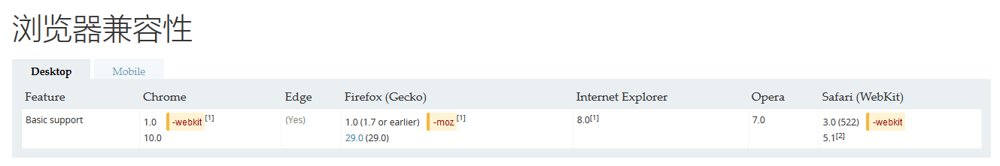

[链接](https://developer.mozilla.org/zh-CN/docs/Web/CSS/Reference#关键字索引)

#### 1.[box-sizing](https://developer.mozilla.org/zh-CN/docs/Web/CSS/box-sizing)

用于更改用于计算元素宽度和高度的默认的CSS盒子模型。

值：

- context-box：默认值，标准盒子模型。width与height只包括内容的宽和高，不包括边框，内边距，外边距。即内边距，边框，外边距都在这个盒子的外部。

- border-box：width和height属性包括内容，内边距和边框，但不包括外边距。

- padding-box：width和height属性包括内容和内边距，但不包括边框和外边距，只在firefox实现了这个值，在firefox50中被删除。



**浏览器前缀**：`-webkit`、`-moz`；*chrome1.0需使用前缀，chrome10.0已移除-webkit前缀*。

建议将所有的元素的box-sizing都设为border-box：
```
    *,*:before,*:after{
        -webkit-box=sizing:border-box;
        -moz-box-sizing:border-box;
        box-sizing:border-box;
    }
```
疑问：bootstrap为什么要这样分开写？
```
    * {
        -webkit-box-sizing: border-box;
            -moz-box-sizing: border-box;
                box-sizing: border-box;
        }
    *:before,
    *:after {
    -webkit-box-sizing: border-box;
        -moz-box-sizing: border-box;
            box-sizing: border-box;
    }
```