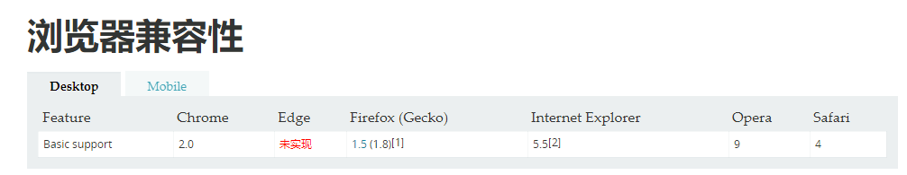

[链接](https://developer.mozilla.org/zh-CN/docs/Web/CSS/Reference#概念)

### 语法和语义
#### 1.[@规则](https://developer.mozilla.org/zh-CN/docs/Web/CSS/At-rule)

- [@charset](https://developer.mozilla.org/zh-CN/docs/Web/CSS/@charset)：定义样式表使用的字符集。

    1. 它必须是样式表中的第一个元素，而前面不得有任何字符；
    2. 因为他不是一个嵌套语句，不能在@规则条件组中使用；
    3. 如果有多个@charset被声明，只有第一个会被使用；
    4. 不能再HTML元素或HTML页面的字符集相关`<style>`元素内的样式属性内使用。
    ```
        @charset "UTF-8";
        @charset "iso-8859-15";
    ```

    

- [@import](https://developer.mozilla.org/zh-CN/docs/Web/CSS/@import)：告诉CSS引擎引入一个外部样式表。

    1. 必须先于所有其他类型的规则，`@charset规则`除外；
    2. 因为他不是一个嵌套语句，不能再条件组的规则中使用。

    语法：
    ```
        @import url;
        @import url list-of-media-queries;
    ```
    - url：要引入资源位置的string或者uri；
    - list-of-media-queries：是一个逗号分隔的媒体查询条件列表，如果浏览器不支持列表中的任何一条媒体查询条件，就不会引入URL指明的CSS文件。

    ```
        示例：
            @import url("fineprint.css") print;
            @import url("bluish.css") projection, tv;
            @import 'custom.css';
            @import url("chrome://communicator/skin/");
            @import "common.css" screen, projection;
            @import url('landscape.css') screen and (orientation:landscape);
    ```

- [@namespace](https://developer.mozilla.org/zh-CN/docs/Web/CSS/@namespace)：告诉CSS引擎必须考虑XML命名空间。

- [@media](https://developer.mozilla.org/zh-CN/docs/Web/CSS/@media)：如果满足媒体查询的条件则条件规则组里的规则生效。

- [@page](https://developer.mozilla.org/zh-CN/docs/Web/CSS/@page)：描述打印文档时布局的变化。

- [@font-face](https://developer.mozilla.org/zh-CN/docs/Web/CSS/@font-face)：描述将下载的外部的字体。

- [@keyframes](https://developer.mozilla.org/zh-CN/docs/Web/CSS/@keyframes)：描述CSS动画的中间步骤。

- [@supports](https://developer.mozilla.org/zh-CN/docs/Web/CSS/@supports)：如果满足给定条件则条件规则组里的规则生效。

- [@document](https://developer.mozilla.org/zh-CN/docs/Web/CSS/@document)：如果文档样式表满足给定条件则条件规则组里的规则生效。

- 条件规则组：他们所指的条件总等效于true或者false，如果为true那么他们里面的语句生效。

    1. @media;
    2. @supports;
    3. @document。

---

#### 2.[优先级](https://developer.mozilla.org/zh-CN/docs/Web/CSS/Specificity)

---

#### 3.[简写属性](https://developer.mozilla.org/zh-CN/docs/Web/CSS/Shorthand_properties)

- 补充：后来的简写属性会覆盖掉之前的属性：
    ```
        background-color: red;
        background: url(imges/bg.gif);
    ```
    这里background简写属性只指定了background-image，但他会覆盖掉background-color；所以对于后来的属性，最好是写详细的，不要写简写。

--- 

#### 4.[CSS属性值定义语法](https://developer.mozilla.org/zh-CN/docs/Web/CSS/Value_definition_syntax)

--- 

### 布局

#### 5.[块格式化上下文](https://developer.mozilla.org/zh-CN/docs/Web/Guide/CSS/Block_formatting_context)

---

#### 6.[盒子模型](https://developer.mozilla.org/zh-CN/docs/Web/CSS/CSS_Box_Model/Introduction_to_the_CSS_box_model)

---

#### 7.[替换元素](https://developer.mozilla.org/zh-CN/docs/Web/CSS/Replaced_element)

---

#### 8.[外边距合并](https://developer.mozilla.org/zh-CN/docs/Web/CSS/CSS_Box_Model/Mastering_margin_collapsing)

块的顶部外边距和底部外边距有时会被组合为单个外边距，其大小是组合到其中的最大外边距，这种行为成为外边距塌陷，或者是外边距合并。

发生的三种基本情况：

1. 相邻的兄弟姐妹元素：毗邻的两个兄弟元素之间的外边距会合并；
2. 块级父元素与其第一个/最后一个子元素：如果块级父元素中，不存在`上边框`、`上内边距`、`内联元素`、`块格式化上下文`、`清除浮动`这五条（也可以说，当上边框宽度及上内边距距离为0时），那么这个块级父元素和其第一个子元素就会发生上外边距合并现象。也就是说，此时这个父元素对外展现出来的外边距将直接变成这个父元素和其第一个子元素的margin-top的较大者。
3. 空块元素：如果存在一个空的块级元素，其border、padding、inline content、height、min-height都不存在，那么他的上下边距中间将没有任何阻隔，此时他的上下外边距将会合并。

---

#### 9.[包含块](https://developer.mozilla.org/zh-CN/docs/Web/CSS/All_About_The_Containing_Block)

---

#### 10.[视觉格式化模型](https://developer.mozilla.org/zh-CN/docs/Web/Guide/CSS/Visual_formatting_model)

---

#### 11.[布局模式](https://developer.mozilla.org/zh-CN/docs/Web/CSS/Layout_mode)

