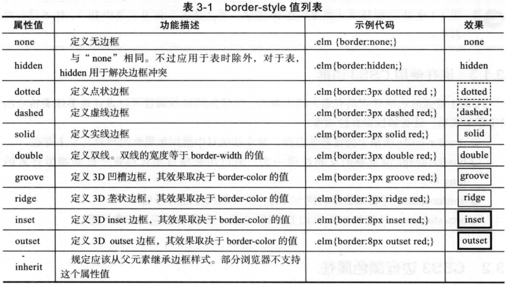

*[CSS各属性查询表](https://meiert.com/en/indices/css-properties/)*

# 第二章 CSS3选择器

### 2.1.2 选择器分类
#### 1. 基本选择器
#### 2. 层次选择器
1. E F ：后代选择器；
2. E>F : 子选择器；
3. E+F : 相邻兄弟选择器;
4. E~F : 通用选择器；`新`，用于选择某元素后面的所有兄弟元素。
#### 3. 伪类选择器
伪类选择器都以`冒号（:）`开头；
#### 3.1 动态伪类选择器
并不存在于HTML中，只有当用户和网站交互的时候才能体现出来。动态伪类包含两种：链接中长看到的`锚点伪类`，另一种为`用户行为伪类`；
1. E:link || （链接伪类） || 未被访问过的超链接；
2. E:visited || （链接伪类） || 已被访问过的超链接；
3. E:active || （用户行为） || 匹配元素被激活（常用于锚点与按钮上）；
4. E:hover || （用户行为） || 用户鼠标停留在元素上，（IE6及以下浏览器仅支持a:hover）；
5. E:focus || （用户行为） || 匹配的元素获得焦点。

*PS：锚点伪类的设置必须遵守“爱恨原则”LoVe/HAte*,`l`ink-`v`isited-`h`over-`a`ctive；-focus（bootstrap将其定义在最后）。
#### 3.2 目标伪类选择器 `新`
“:target”，用来匹配文档（页面）的URI中某个标识符的目标元素。URI中的标识符通常会包含一个（#），后面带有一个标识符名称，如“#contact”，“:target”就是用来匹配ID为"contact"的元素的。“:target”伪类选择器选取链接的目标元素，然后供定义样式。

*PS：IE8及之前版本不支持，但IE用户点击目录里的链接仍将跳转到相应的标题，只是标题不会高亮显示。*

*PS：实战，手风琴效果。*

#### 3.3 语言伪类选择器
```
<html lang="en"></html>

:lang(en) a{bolor:red;}
```

#### 3.4 UI元素状态伪类选择器 `新`
UI元素的状态包括：启用、禁用、选中、未选中、获得焦点、失去焦点、锁定和待机等。

1. E:checked - 选中状态伪类选择器
2. E:enabled - 启用状态伪类选择器
3. E:disabled - 不可用状态伪类选择器

*PS：参考bootstrap的表单元素UI状态；支持到IE9*

#### 3.5 结构伪类选择器 `新`
1. E:first-child  ~ 作为父元素的第一个子元素的元素E。与E:nth-child(1)等同；
2. E:last-child   ~ 作为父元素的最后一个子元素的元素E。与E:nth-last-child(1)等同；
3. E:root         ~ 选择匹配元素E所在文档的根元素。在html文档中，根元素始终是html，此时该选择器与html类型选择器匹配的内容相同；
4. E F:nth-child(n) ~ 选择父元素E的第n个子元素F。其中n可以是`整数`（1.2.3.）、`关键字`（even、odd）、可以是`公式`（2n+1、-n+5），而且n值`起始为1`，而不是0；
5. E F:nth-last-child(n) ~ 选择元素E的倒数第n个子元素F。此选择器与E F:nth-child(n)选择器计算顺序刚好相反。但使用方法都是一样的，其中:nth-last-child(1)始终匹配的是最后一个元素，与:last-child等同；
6. E:nth-of-type(n) ~ 选择父元素内具有制定类型的第n个E元素；
7. E:nth-last-of-type(n) ~ 选择父元素内具有制定类型的倒数第n个E元素；
8. E:first-of-type ~ 选择父元素内具有制定类型的第一个E元素，与E:nth-of-type(1)等同；
9. E:last-of-type ~ 选择父元素内具有制定类型的最后一个E元素，与E:nth-last-of-type(1)等同；
10. E:only-child ~ 选择父元素只包含一个子元素，且该子元素匹配E元素；
11. E:only-of-type ~ 选择父元素只包含一个同类型的子元素，且该子元素匹配E元素；
12. E:empty ~ 选择没有子元素的元素，而且该元素也不包含任何文本节点。

*PS：只有 :first-child 属于CSS2.1，其他的都是CSS3的新特性；支持到IE9*

#### 3.6 否定伪类选择器  `新`
:not() - 用来定位不匹配该选择器的元素，起到过滤内容的作用。

input:not([type=submit]){...}

*支持到IE9*

#### 4. 伪元素 `新`
伪元素可用于定位文档中包含的文本，但无法在文档树中定位。伪类一般反映无法在CSS中轻松或可靠地检测到的某个元素属性或状态；另一方面，伪元素表示DOM外部的某种文档结构。

CSS中一直有的：:first-line、:first-letter、:before、:after；CSS3中增加一个冒号：::first-line、::first-letter、::before、::after，同时增加一个：::selection。

IE6~8,仅支持单冒号表示法，CSS3使用双冒号与单冒号来区分伪类和伪元素。

- ::first-letter ~ 用来选择文本块的第一个字母，除非在同一行中包含一些其他元素。
- ::first-line ~ 用来匹配元素的第一行文本。
- ::before和::after ~ 不是指存在于标记中的内容，而是可以插入额外内容的位置。尽管生成的内容不会成为DOM的一部分，但它同样可以设置样式。
- ::selection ~ 用来匹配突出显示的文本。

*PS ::selection仅接受两个属性：`background`、`color`*

#### 5. 属性选择器
可基于元素的属性来匹配元素；

在CSS2的基础上新增3个属性选择器：
1. E[attr]  选择匹配具有属性attr的E元素;
2. E[attr=val]  选择匹配具有属性attr的E元素，并且attr的属性值为bal（区分大小写）;
3. E[attr|=val] 选择匹配E元素，且E元素定义了属性attr，attr属性值是一个具有val或者以val-开始的属性值;
4. E[attr~=val] 选择匹配E元素，且E元素定义了属性attr，attr属性值具有多个空格分隔的值，其中一个值等于val;
5. E[attr*=val] 选择匹配元素E，且E元素定义了属性attr，其属性值任意位置包含了val;
6. E[attr^=val] 选择匹配元素E，且E元素定义了属性attr，其属性值以val开头的任何字符串;
7. E[attr$=val] 选择匹配元素E，且E元素定义了属性attr，其属性值以val结尾的任何字符串;

*PS： `^`：匹配起始符； `$`：匹配终止符； `*`：匹配任意字符。支持IE7*

---

# 第三章 CSS3边框
### 3.1 CSS3边框简介
#### 3.1.1 基本属性
- border-width：默认值“medium”（3~4px）;
- border-style：默认none；
- border-color: 默认字体的颜色；


但各浏览器均有差异

#### 3.2 CSS3边框颜色属性
CSS3在语法上做了一定修改：border-color: [ <color> | transparent ]{1,4} | inherit；
但是如果使用border-color这种缩写语法，将不会有任何效果，必须将这个border-color标准写法拆分成四个边框，使用多颜色才会有效果：
border-top-colors: [ <color> | transparent ]{1,4} | inherit；
*属性中是`colors`；为了让不同浏览器都能渲染，需要加前缀：其中，KHTML引擎内核是 `-khtml`*

当boder-color设置了n个颜色，并且边框宽度也为n像素，就可以每种颜色显示1像素的宽度。如果宽度值大于颜色数量的值，最后一种颜色用于显示剩下的宽度。

目前仅firefox3.0及以上支持

#### 3.3 CSS3图片边框属性
基本语法：
border-image: none | <image> [<number> | <percentage>] {1,4} [/ <border-width>{1,4}] ?[stretch | repeat | round] {0,2}

- none: 默认值，表示边框无背景图片
- <image>：设置背景图片，这跟background-image一样，可以使用绝对或相对的URL地址，来制定边框的背景图片；
- <number>：number是一个数值，用来设置边框或者边框背景图片的大小，其单位是像素，可以使用1~4个值，表示4个方位的值；
- <percentage>：percentage也是用来设置边框或者边框背景图片的大小，跟number不同之处是，percentage使用的是百分比；
- stretch、repeat、round：这三个属性参数是用来设置边框背景图片的铺放方式，类似于background-position，其中stretch会拉伸边框背景图片、repeat是会重复边框背景图片、round是平铺边框背景图片，其中stretch为默认值。


#### 3.4 CSS3圆角边框属性

#### 3.5 CSS3盒子阴影属性