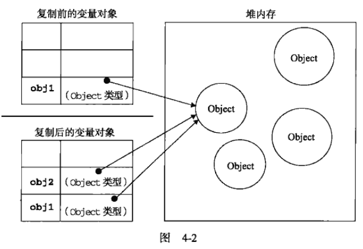

# JavaScript高级程序设计3

## 第4章 变量、作用域和内存问题

js变量松散类型的本质，决定了它只是在特定时间用于保存特定值的一个名字而已。由于不存在定义某个变量必须要保存何种数据类型值得规则，变量的值及其数据类型可以在脚本的生命周期内改变。

### 4.1 基本类型和引用类型的值

基本类型值指的是简单的数据段，而引用类型指那些可能由多个值构成的对象。

基本数据类型是按值访问的，因为可以操作保存在变量中的实际的值。

引用类型的值是保存在内存中的对象，不允许直接访问内存中的位置，也就是说不能直接操作对象的内存空间。在操作对象时，实际上是在操作对象的引用而不是实际的对象。因此，引用类型的值是按引用访问的。

#### 4.1.1 复制变量值

如果从一个变量向另一个变量复制基本类型的值，会在变量对象上创建一个新值，然后把该值复制到新变量分配的位置上：

```js
var num1 =5;
var num2 = num1;
```

这里num2的5与num1的5是完全独立的，该值只是num1中5的一个副本；此后，两个变量可以参与任何操作而不会相互影响。

当从一个变量向另一个变量复制引用类型的值时，同样也会将存储在变量对象中的值复制一份放到为新变量分配的空间中。不同的是，这个值得副本实际上是一个指针，而这个指针指向存储在堆中的一个对象（`堆内存`）。复制操作结束后，两个变量实际上将引用同一个对象，改变其中一个变量，就会影响另一个变量：

```js
var obj1 = new Object();
var obj2 = obj1;
obj1.name = "Nicholas";
alert(obj2.name);   //"Nicholas"
```



#### 4.1.3 传递参数

ECMAScript中所有函数的参数都是按指传递的，也就是说，把函数外部的值复制给函数内部的参数，就和把值从一个变量复制到另一个变量一样。

`可以把ECMAScript函数的参数想象成局部变量`。在向参数传递基本类型的值时，被传递的值被赋值给一个局部变量（即命名参数，或者arguments对象中的一个元素）；在向参数传递引用类型时，会把这个值在内存中的地址（指针）复制给一个局部变量，因此这个局部变量的变化会反映在函数的外部。

- 传递基本数据类型

```js
function addTen(num) {
    num += 10;
    return num;
}

var count = 20;
var result = addTen(count);  //按值传递 num = count
alert(count);  // 20, 没变化
alert(result);  // 30
```

- 传递引用类型

```js
function setName(obj) {
   obj.name = "Nicholas";
}

var person = new Object();
setName(person);   //相当于按值传递  obj = person
alert(person.name);   // "Nicholas"
```

在这个函数内部，obj和person引用的是同一个对象，也就是说，即使这个对象是按值传递的，obj也会按引用来访问同一个对象。于是当在函数内部为obj添加name属性后，函数外部的person也将有所反映；因为perso指向的对象在堆内存中只有一个，而且是全局对象。

很多人错误的认为：在局部作用域中修改的对象会在全局作用域中反映出来，就说明参数是按引用传递的。但对象是按值传递的：

```js
function setName(obj) {
    obj.name = "Nicholas";
    obj = new Object(); //改变obj的指向，此时obj指向一个新的内存地址，不再和person指向同一个
    obj.name = "Greg";
}

var person = new Object();
setName(person);  //确实是按值传递的
alert(person.name);  //"Nicholas"
```

如果person是按引用传递的，那么person就会自动被修改为指向其name属性值为Greg的新对象。但结果说明，即使在函数内部修改了参数的值，但原始的引用仍然保持未变。实际上，当在函数内部重写obj时，这个变量引用的就是一个局部对象了，而这个局部对象会在函数执行完毕后立即被销毁。

#### 4.1.4 检测类型

- `typeof操作符`是确定一个变量是字符串、数值、布尔值还是undefined的最佳工具：

```js
var s = "Nivholas";
var b = true;
var i = 22;
var u;
var n = null;
var o = new Object();
var arr = [];
var f = function(){}

console.log(typeof s);    //string
console.log(typeof b);    //boolean
console.log(typeof i);    //number
console.log(typeof u);    //undefined
console.log(typeof n);    //object
console.log(typeof o);    //object
console.log(typeof arr);    //object
console.log(typeof f);    //function
```

虽然检测基本数据类型时typeof很有用，但是在检测引用类型的值时，并没有什么用。

- `instanceof操作符`可以知道他是什么类型的对象：

```js
console.log(person instanceof Object);   //变量person是Object吗？
console.log(person instanceof Array);   //变量person是Array吗？
console.log(person instanceof RegExp);   //变量person是RegExp吗？
console.log(person instanceof Function);   //变量person是Function吗？
```

因为所有引用类型的值都是Object的实例，所以在检测一个引用类型值和Object构造函数时，instanceof操作符始终会返回true。

**注意**：使用typeof检测函数时，会返回"function"。在Safari5及之前的版本和Chrome7及之前的版本使用typeof检测正则表达式时，由于规范的原因，这个操作符也会返回"function"。ECMA-262规定任何在内部实现[[call]]方法的对象都应该在应用typeof时返回"function"。由于上述浏览器中的正则表达式也实现了这个方法，因此对正则表达式应用typeof会返回"function"。子啊IE和Firefox中，对正则表达式应用typeof会返回"object"。

---

### 4.2 执行环境及作用域

当代码在一个环境中执行时，会创建变量对象的一个`作用域链`。作用域链的用途，是保证对执行环境有权访问的所有变量和函数的有序访问。作用域链的前端，始终都是当前执行的代码所在环境的变量对象。如果这个环境是函数，则将其活动对象作为变量对象。活动对象在最开始时只包含一个变量，即arguments对象（这个对象在全局环境中是不存在的）。作用域链中的下一个变量对象来自包含（外部）环境，而再下一个变量对象则来自下一个包含环境。一直这样延续到全局环境；全局执行环境的变量对象始终都是作用域链中的最后一个对象。

内部环境可以通过作用域链访问所有的外部环境，但外部环境不能访问内部环境中的任何变量和函数。

#### 4.2.1 延长作用域链

有些语句可以在作用域链的前端临时增加一个变量对象，该变量对象会在代码执行后被移除。当执行流进入下列任何一个语句时，作用域链就会得到加长：

1. try-catch语句的catch块；
2. with语句。

这两个语句都会在作用域链的前端添加一个变量对象，对with语句来说，会将指定的对象添加到作用域链中；对catch语句来说，会创建一个新的变量对象，其中包含的是被抛出的错误对象的声明。

**注意**：在IE8及之前版本的js实现中，在catch语句中捕获的错误对象会被添加到执行环境的变量对象，而不是catch语句的变量对象中。换句话说，即使是在catch块的外部也可以访问到错误对象。IE9修复了这个问题。

#### 4.2.2 没有块级作用域

js没有块级作用域，在其他类C语言中，由花括号封闭的代码块都有自己的作用域（如果ECMAScript的话来讲，就是他们自己的执行环境）。对于有块级作用域的语言来说，for语句初始化变量的表达式所定义的变量，只会存在于循环的环境之中；而对于js来说，由for语句创建的变量i即使在for循环执行结束后，也依旧会存在于循环外部的执行环境中。

- 1.声明变量

使用var声明的变量会自动被添加到最接近的环境中，如果初始化变量时没有使用var声明，该变量会自动被添加到全局环境。

- 2.查询标识符

当在某个环境中为了读取或写入而引用一个标识符时，必须通过搜索来确定该标识符实际代表什么。搜索过程从作用域链的前端开始，如果在局部环境中找到了该标识符，搜索过程停止，变量就绪；如果没有找到，则继续沿作用域链向上搜索；搜索过程将一直追溯到全局环境的变量对象，如果全局环境中也没有，则以为这该变量尚未声明。也就意味着，如果局部环境中存在着同名标识符，就不会使用位于父环境中的标识符。

```js
var color = "blue";

function getColor(){
    return color;
}

alert(getColor());  //blue
```

---

### 4.3 垃圾收集

垃圾收集机制的原理：找出那些不再继续使用的变量，然后释放其占用的内存。为此，垃圾收集器会按照固定的时间间隔（或代码执行中的收集时间），周期性的执行这一操作。

函数中局部变量的正常生命周期：局部变量只在函数执行的过程中存在，而在这个过程中，会为局部变量在栈（或堆）内存上分配相应的空间，以便存储他们的值。然后再函数中使用这些变量，直至函数执行结束。此时，局部变量就没有存在的必要了，因此可以释放他们的内存以供将来使用。

#### 4.3.1 标记清除

#### 4.3.2 引用计数

#### 4.3.3 性能问题

垃圾收集器是周期性运行的。在IE中，调用 window.CollectGarbage() 方法会立即执行垃圾收集；在Opera7及更高版本，调用 window.opera.collect() 也会启动垃圾收集例程。

#### 4.3.4 管理内存

优化内存占用的最佳方式，就是为执行中的代码之保存必要的数据。一旦数据不再游泳，最好通过将其设置为null来释放其引用--这个做法叫做`解除引用`。这一做法适用于大多数全局变量和全局对象的属性。局部变量会在他们离开执行环境时自动被解除引用。不过，接触一个值得引用并不意味着自动回收该值所占用的内存，接触引用的真正作用是让值脱离执行环境，以便垃圾收集器下次运行时将其回收。

---

#### 4.4 小结

基本类型值和引用类型值具有以下特点：

1. 基本类型值在内存中占据固定大小的空间，因此被保存在栈内存中；
2. 从一个变量向另一个变量复制基本类型的值，会创建这个值得一个副本；
3. 引用类型的值是对象，保存在堆内存中；
4. 包含引用类型值的变量实际上包含的并不是对象本身，而是一个指向该对象的指针；
5. 从一个变量向另一个变量复制引用类型的值，复制的其实是指针，因此两个变量最终都指向同一个对象；
6. 确定一个值是哪种基本类型可以用typeof操作符，而确定一个值是哪种引用类型可以使用instanceof操作符。

所有变量（包括基本类型和引用类型）都存在于一个执行环境（也称为作用域）当中，这个执行环境决定了变量的生命周期，以及哪一部分代码可以访问其中的变量。以下是关于执行环境的几点总结：

1. 执行环境有全局执行环境和函数执行环境之分；
2. 每次进入一个新执行环境，都会创建一个用于搜索变量和函数的作用域链；
3. 函数的局部环境不仅有权访问函数作用域中的变量，而且有权访问其包含（父）环境，乃至全局环境；
4. 全局环境只能访问在全局环境中定义的变量和函数，而不能直接访问局部环境中的任何数据；
5. 变量的执行环境有助于确定应该何时释放内存。

js是一门具有自动垃圾收集机制的编程语言，js的垃圾收集例程总结：

1. 离开作用域的值将被自动标记为可以回收，因此将在垃圾收集期间被删除；
2. “标记清除”是目前主流的垃圾收集算法，这种算法的思想是给当前不使用的值加上标记，然后再回收其内存；
3. 另一种垃圾收集算法是“引用计数”，这种算法的思想是跟踪记录所有指被引用的次数。js引擎目前都不再使用这种算法，但在IE中访问非原生js对象（如DOM元素）时，这种算法仍然可能会导致问题；
4. 当代码中存在循环引用现象时，“引用计数”算法就会导致问题；
5. 解除变量的引用不仅有助于消除循环引用现象，而且对垃圾收集也有好处。为了确保有效地回收内存，应该及时解除不再使用的全局对象、全局对象属性以及循环引用变量的引用。
