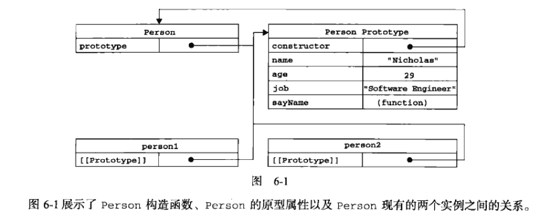
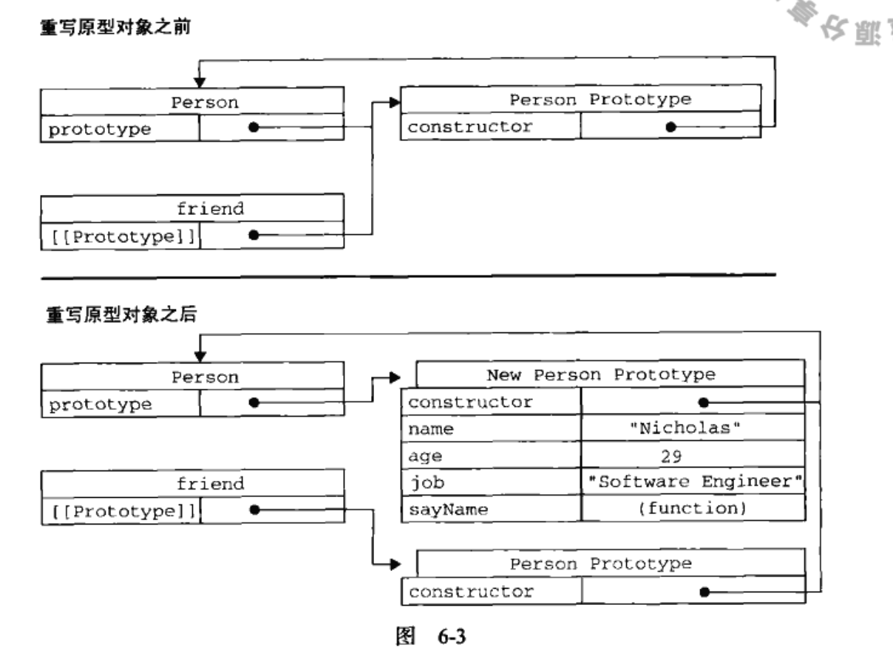
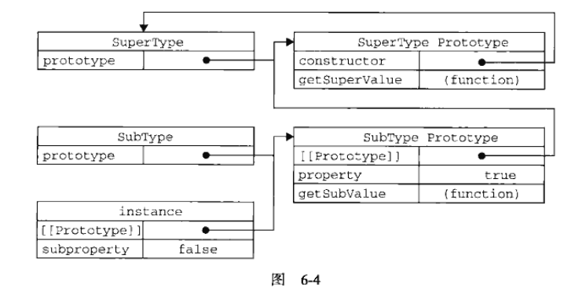
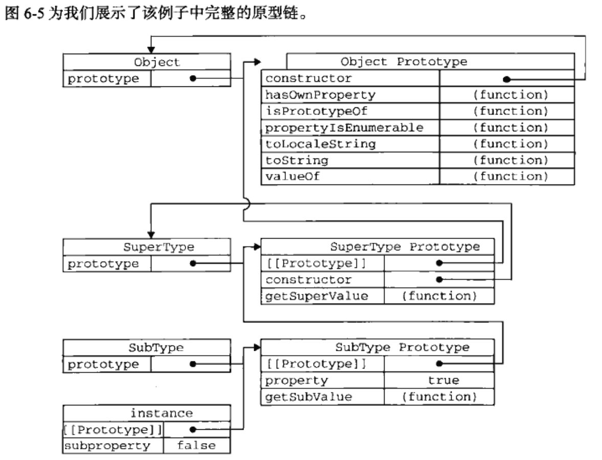
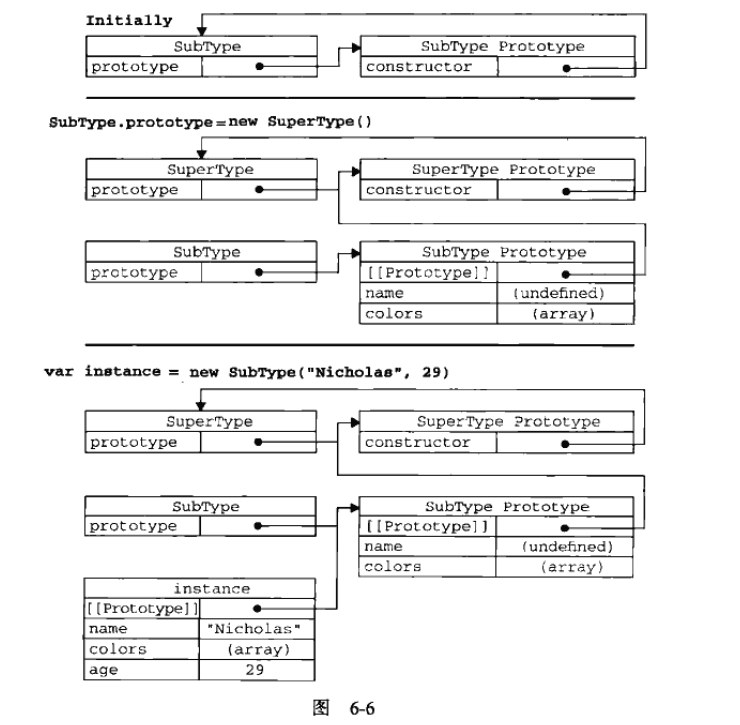

# JavaScript高级程序设计3

## 第6章 面向对象的程序设计

面向对象（OO）的语言有一个标志，它们都有类的概念，通过类可以创建任意多个具有相同属性和方法的对象。

但ECMAScript中没有类的概念，ECMA-262吧对象定义为：`无序属性的集合，其属性可以包含基本值、对象或者函数`。这相当于说对象是一组没有特定顺序的值。

对象的每个属性或方法都有一个名字，而每个名字都映射到一个值；我们可以吧ECMAScript的对象想象成散列表：无非就是一组名值对，其中值可以是数据或函数。

每个对象都是基于一个引用类型创建的，也可以是开发人员定义的类型。

### 6.1 理解对象

```js   //创建一个Object的实例，然后再为他添加属性和方法
var person = new Object();
person.name = 'Nicholas';
person.age = 25;
person.job = 'Software Engineer';
person.sayName = function(){
    console.log(this.name);
}

//对象字面量语法：
var person = {
    name: 'Nicholas',
    age: 25,
    job: 'Software Engineer',

    sayName: function(){
        console.log(this.name);
    }
}
```

#### 6.1.1 属性类型

ECMAScript中有两种属性：数据属性和访问器属性。

##### 6.1.1.1 `数据属性`

数据属性包含一个数据值的位置，在这个位置可以读取和写入值。数据属性有4个描述其行为的特性：

1. `[[Configurable]]`：表示能否通过delete删除属性从而重新定义属性，能否修改属性的特性，或者能否把属性修改为访问器属性。像上面例子中那样直接在对象上定义的属性，他们的这个特性默认值是true。
2. `[[Enumerable]]`：表示能否通过for-in循环返回属性。像上面例子中那样直接在对象上定义的属性，他们的这个特性默认值为true。
3. `[[Writable]]`：表示能否修改属性的值。像上面例子中那样直接在对象上定义的属性，他们的这个特性默认值为true。
4. `[[Value]]`：包含这个属性的数据值。读取属性值时，从这个位置读；写入属性值时，把新值保存在这个位置。这个特性的默认值为undefined。

```js
ver person = {
    name: 'Nicholas'
}
```

这里创建了一个名为name的属性，为它指定的值是"Nicholas"，也就是说，[[Value]]特性将被设置为此，而对这个值得任何修改都将反映在这个位置。

要修改属性默认的特性，必须使用ECMAScript5的Object.defineProperty()方法。接收三个参数：属性所在的对象，属性的名字、一个描述符对象。其中，描述符对象的属性必须是：configurable、enumerable、writeable、value，设置其中的一或多个值，可以修改对应的特性值：

```js
var person = {};
Object.defineProperty(person, "name", {
    writeable: false,
    value: "Nicholas"
});

console.log(person.name); //Nicholas
person.name = "Greg";
console.log(person.name); //Nicholas
```

这个例子创建了一个只读属性name，它不可修改，如果尝试为它指定新值，则在非严格模式下，赋值操作将被忽略；在严格模式下，赋值操作将会导致抛出错误。

##### 6.1.1.2 访问器属性

访问器属性不包含数据值；他们包含一对getter和setter函数（都不是必需的）。在读取访问器属性时，会调用getter函数，这个函数负责返回有效的值；在写入访问器属性时，会调用setter函数并传入新值，这个函数负责决定如何处理数据。访问器属性有如下特性：

1. `[[Configurable]]`：表示能否通过delete删除属性从而重新定义属性，能否修改属性的特性，或者能否把属性修改为访问器属性。像上面例子中那样直接在对象上定义的属性，他们的这个特性默认值是true。
2. `[[Enumerable]]`：表示能否通过for-in循环返回属性。像上面例子中那样直接在对象上定义的属性，他们的这个特性默认值为true。
3. `[[Get]]`：在拂去属性时调用的函数。默认值为undefined。
4. `[[Set]]`：在写入属性时调用的函数。默认值是undefined。

访问器属性不能直接定义，必须使用Object.defineProperty()来定义：

```js
var book = {
    _year:2004,
    edition:1
};
Object.defineProperty(book, "year", {
    get: function(){
        return this._year;
    },
    set: function(newValue){
        if(newValue > 2004){
            this._year = newValue;
            this.edition += newValue - 2004;
        }
    }
});

book.year = 2005;
console.log(book.edition); //2
```

不一定非要同时指定getter和setter。只指定getter意味着属性是不能写，尝试写入属性会忽略。在严格模式下，会抛出错误。同样的，没有指定getter函数的属性也不能读，否则在非严格模式下会返回undefined，而在严格模式下会抛出错误。

**兼容性**：IE9+（IE8部分兼容）、FireFox4+、Safari5+、Opera12+和Chrome。

在这个方法之前，一般都使用两个非标准的方法：`__defineGetter__()`和`__defineSetter__()`。

#### 6.1.2 定义多个属性

ECMAScript定义了一个Object.defineProperties()方法，可以通过描述符一次定义多个属性。这个方法接收两个对象参数：第一个参数是要添加和修改其属性的对象，第二个参数--对象的属性与第一个对象中要添加和修改的属性一一对应：

```js
var book = {};
Object.defineProperties(book,{
    _year: {
        value: 2004
    },
    edition: {
        value: 1
    },
    year: {
        get: function(){
            return this._year;
        },
        set: function(newValue){
            if(newValue > 2004){
                this._year = newValue;
                this.edition += newValue - 2004;
            }
        }
    }
});
```

**兼容性**：IE9+、FireFox4+、Safari5+、Opera12+和Chrome。

#### 6.1.3 读取属性的特性

ECMAScript5提供`Object.getOwnPropertyDescriptor()`方法，可以取得给定属性的描述符。这个方法接收两个参数：属性所在的对象和要读取其描述符的属性名称。返回值是一个对象，如果是访问器属性，这个对象的属性有：configurable、enumerable、get和set；如果是数据属性，这个对象的属性有configurable、enumrable、writeable和value：

```js
var book = {};
Object.defineProperties(book,{
    _year: {
        value: 2004
    },
    edition: {
        value: 1
    },
    year: {
        get: function(){
            return this._year;
        },
        set: function(newValue){
            if(newValue > 2004){
                this._year = newValue;
                this.edition += newValue - 2004;
            }
        }
    }
});

var descriptor = Object.getOwnPropertyDescriptor(book,"_year");
console.log(descriptor.value); //2004
console.log(descriptor.configurable); //false
console.log(descriptor.get); //"undefined"
var descriptor2 = Object.getOwnPropertyDescriptor(book,"year");
console.log(descriptor2.value); //undefined
console.log(descriptor2.enumerable);//false
console.log(descriptor2.get);//"function"
```

在js中，可以针对任何对象--包括DOM和BOM对象，使用Object.getOwnProperDescriptor()方法。

**兼容性**：IE9+、FireFox4+、Safari5+、Opera12+和Chrome。

---

### 6.2 创建对象

#### 6.2.1 工厂模式

ECMAScript中无法创建类，但可以用函数来封装以特定接口创建对象的细节：

```js
function createPerson(name, age, job){
    var o = new Object();
    o.name = name;
    o.age = age;
    o.job = job;
    o.sayName = funtion(){
        console.log(this.name);
    }
    return o;
}

var person1 = createPerson('Nicholas',29,'Software Engineer');
var person2 = createPerson('Greg',27,'Doctor');
```

函数createPerson()能够根据接受的参数来构建一个包含所有必要信息的Person对象，可以数次地调用这个函数，而每次它都会返回一个包含三个属性一个方法的对象。但是工厂模式不能解决对象识别的问题（即怎样知道一个对象的类型）。

#### 6.2.2 构造函数模式

ECMAScript中的构造函数可用来创建特定类型的对象，如Object和Array这样的原生构造函数，在运行时会自动出现在执行环境中。也可以创建自定义的构造函数，从而定义自定义对象类型的属性和方法：

```js
function Person(name, age, job){
    this.name = name;
    this.age = age;
    this.job = job;
    this.sayName = funtion(){
        console.log(this.name);
    }
}

var person1 = new Person('Nicholas',29,'Software Engineer');
var person2 = new Person('Greg',27,'Doctor');
//Person()与createPerson()相比，
//1. 没有显示的创建对象；
//2. 直接将属性和方法赋给了this对象；
//3. 没有return语句
```

**注意**：构造函数始终都应该以一个大写字母开头，而非构造函数则应该以一个小写字母开头。主要是为了区别于其他函数，因为构造函数本身也是函数，只不过可以用来创建对象而已。

**注意**：要创建Person的新实例，必须使用`new`操作符。使用new调用构造函数实际上经历了以下4步：

1. 创建一个新对象；
2. 将构造函数的作用域赋给新对象（因此this就指向了这个新对象）；
3. 执行构造函数中的代码（为这个新对象添加属性）；
4. 返回新对象。

这个例子中，person1和person2分别保存着Person的一个不同实例，这两个对象都有一个`constructor`（构造函数）属性，该属性指向Person：

```js
console.log(person1.constructor == Person);  //true
console.log(person2.constructor == Person);  //true
```

对象的constructor属性最初是用来标识对象类型的。但是检测对象类型，还是instanceof操作符更靠谱一些：

```js
console.log(person1 instanceof Object);  //true
console.log(person1 instanceof Person);  //true
console.log(person2 instanceof Object);  //true
console.log(person2 instanceof Person);  //true

//通过Person创建的对象，即是Object的实例，也是Person的实例
```

创建自定义的构造函数可以将它的实例标识为一种特定的类型。

##### 6.2.2.1 将构造函数当作函数

构造函数与其他函数的唯一区别，就在于调用它们的方式不同。不过，构造函数毕竟也是函数，不存在定义构造函数的特殊语法。任何函数，只要通过new操作符来调用，那它就可以作为构造函数；而任何函数，如果不通过new操作符来调用，那它跟普通函数也不会有什么两样：

```js
//当作构造函数使用
ver person = new Person('Nicholas',29,'Software Engineer');
person.sayName();
//作为普通函数调用
Person('Greg',29,'Software Engineer'); //添加到window。当在全局作用域中调用一个函数时，this对象总是指向Global对象（浏览器中就是window对象）
window.sayName();
//在另一个对象的作用域中调用
var o = new Object();
Person.call(o,'Kristen',29,'Software Engineer');
o.sayName();
```

##### 6.2.2.2 构造函数的问题

使用构造函数的主要问题，就是每个方法都要在每个实例上重新创建一遍。例如上例中的person1和person2都有一个名为sayName()的方法，但那两个方法不是同一个Function的实例。每定义一个函数，都是实例化了一个对象：

```js
function Person(name, age, job){
    this.name = name;
    this.age = age;
    this.job = job;
    this.sayName = new funtion("console.log(this.name)"); //与声明函数在逻辑上是等价的
}
```

这个角度看构造函数，每个Person实例都包含一个不同的Function实例。因此不同实例上的同名函数是不想等到的：

```js
console.log(peron1.sayName == person2.sayName);  //false
```

但是创建两个完成同样任务的Function实例的确没有必要；况且有this对象在，根本不用再执行代码前就把函数绑定到特定对象上面。我们可以通过吧函数定义转移到构造函数外部来解决这个问题：

```js
function Person(name, age, job){
    this.name = name;
    this.age = age;
    this.job = job;
    this.sayName = sayName;
}
function sayName(){
    console.log(this.name);
}
```

由于构造函数内部的sayName包含的是一个指向函数的指针，因此person1和person2对象就共享了在全局作用域中定义的同一个sayName()函数。但是，在全局作用域中定义的函数实际上只能被某个对象调用；并且如果对象需要定义很多方法，那么就要定义很多个全局函数，这就不存在封装性可言了。这些问题可通过原型模式解决。

#### 6.2.3 原型模式

我们创建的每个函数都有一个prototype（原型）属性，这个属性是要给指针，指向一个对象，而这个对象的用途是包含可以由特定类型的所有实例共享的属性和方法。也就是说，prototype就是通过调用构造函数而创建的那个对象实例的原型对象。

使用原型对象可以让所有对象实例共享它所包含的属性和方法，不必再构造函数中定义对象实例的信息，而是可以将这些信息直接添加到原型对象中：

```js
function Person(){
}
Person.prototype.name = 'Nicholas';
Person.prototype.age = 29;
Person.prototype.sayName = function(){
    console.log(this.name);
}
var person1 = new Person();
person1.sayName();  //'Nicholas'

var person2 = new Person();
person2.sayName();  //'Nicholas'

console.log(person1.sayName == person2.sayName);  //true
```

##### 6.2.3.1 理解原型对象

只要创建了一个新函数，就会根据一组特定的规则为该函数创建一个`prototype`属性，这个属性指向函数的原型对象。默认情况下，所有原型对象都会自动获得一个`constructor`（构造函数）属性，这个属性包含一个指向prototype属性的所在函数的指针。例如：Person.prototype.constructor指向Person。通过这个构造函数，我们可以继续为原型对象添加其他属性和方法。

创建自定义的构造函数之后，其原型对象默认只会取得constructor属性，其他方法都是从Object继承而来的。当调用构造函数创建一个新实例后，该实例的内部将包含一个指针（内部属性），指向构造函数的原型对象。ECMA-262第5版中这个指针叫`[[Prototype]]`。FireFox、Safari和Chrome在每个对象上都支持一个属性`__proto__`；而在其它实现中，这个属性对脚本是完全不可见的。**重点**：这个连接存在于实例与构造函数的原型对象之间，而不是存在于实例与构造函数之间。



Person.prototype指向了原型对象，而Person.prototype.constructor又指回克Person。原型对象中除了包含constructor属性之外，还包括后来添加的其他属性。Person的每个实例-person1和person2都包含一个内部属性，该属性仅仅指向了Person.prototype，它们与构造函数没有直接关系。

虽然在所有实现中都无法访问到[[Prototype]]，但可以通过`isPrototypeOf()`方法来确定对象之间是否存在这种关系。从本质上讲，如果[[Prototype]]指向调用isPrototypeOf()方法的对象（Person.prototype），那么这个方法就返回true：

```js
console.log(Person.prototype.isPrototypeOf(person1));  //true
console.log(Person.prototype.isPrototypeOf(person2));  //true
//因为person1和person2内部都有一个指向Person.protoype的指针，因此都返回了true
```

ECMAScript5增加了`Object.getPrototypeOf()`，这个方法返回[[Prototype]]的值：

```js
console.log(Object.getPrototypeOf(person1) == Person.prototype);  //true，确定Object.getPrototypeOf()返回的对象实际上就是这个对象的原型
console.log(Object.getPrototypeOf(person1).name);  //'Nicholas'
```

**兼容性**：IE9+、FireFox3.5+、Safari5+、Opera12+和Chrome

每当代码读取某个对象的某个属性时，都会执行一次搜索，目标是具有给定名字的属性。搜索首先从对象实例本身开始，如果在实例中找到了具有给定名字的属性，则返回该属性的值；如果没有找到，则继续搜索指针指向的原型对象，在原型对象中查找具有给定名字的属性。如果在原型对象中找到了这个属性，则返回该属性的值。

*ps*：原型最初只包含constructor属性，而该属性也是共享的，因此可以通过对象实例访问。

虽然可以通过对象实例访问保存在原型中的值，但却不能通过对象实例重写原型中的值。如果我们在实例中添加了一个属性，而该属性与实例原型中的一个属性同名，那我们就在实例中创建该属性，该属性将会屏蔽原型中的那个属性：

```js
function Person(){
}
Person.prototype.name = 'Nicholas';
Person.prototype.age = 29;
Person.prototype.sayName = function(){
    console.log(this.name);
}
var person1 = new Person();
var person2 = new Person();

person1.name = 'Greg';
console.log(person1.name);  //'Greg' -- 来自实例
console.log(person2.name);  //'Nicholas' -- 来自原型
```

当为对象实例添加要给属性时，这个属性就会屏蔽原型对象中保存的同名属性；也就是说，添加这个属性只会阻止我们访问原型中的那个属性，但不会修改那个属性。即使将这个属性设置为null，也只会在实例中设置这个属性，而不会恢复其指向原型的连接。不过，使用delete操作符则可以完全删除实例属性，让我们能够重新访问原型中的属性：

```js
function Person(){
}
Person.prototype.name = 'Nicholas';
Person.prototype.age = 29;
Person.prototype.sayName = function(){
    console.log(this.name);
}
var person1 = new Person();
var person2 = new Person();

person1.name = 'Greg';
console.log(person1.name);  //'Greg' -- 来自实例
console.log(person2.name);  //'Nicholas' -- 来自原型

delete person1.name;
console.log(person1.name);  //'Nicholas' -- 来自原型
```

使用`hasOwnProperty()`方法可以检测一个属性是存在于实例中，还是存在于原型中。这个方法从Object继承而来，只在给定属性存在于对象实例中时，才会返回true：

```js
function Person(){
}
Person.prototype.name = 'Nicholas';
Person.prototype.age = 29;
Person.prototype.sayName = function(){
    console.log(this.name);
}
var person1 = new Person();
var person2 = new Person();

console.log(person1.hasOwnProperty('name')); //false
person1.name = 'Greg';
console.log(person1.name);  //'Greg' -- 来自实例
console.log(person1.hasOwnProperty('name')); //true

console.log(person2.name);  //'Nicholas' -- 来自原型
console.log(person2.hasOwnProperty('name')); //false

delete person1.name;
console.log(person1.name);  //'Nicholas' -- 来自原型
console.log(person1.hasOwnProperty('name')); //false
```

使用hasOwnProperty()方法，可以清楚的知道，此时访问的是实例属性，还是原型属性。

**拓展**：ECMAScript5的Object.getOwnPropertyDescriptor()方法只能用于实例属性，要取得原型属性的描述符，必须直接在原型对象上调用Object.getOwnPropertyDescriptor()方法。

##### 6.3.2.2 原型与in操作符

- 单独使用：在单独使用in操作符时，会在通过对象能够访问给定属性时返回true，无论该属性存在于实例中还是原型中：

```js
function Person(){
}
Person.prototype.name = 'Nicholas';
Person.prototype.age = 29;
Person.prototype.sayName = function(){
    console.log(this.name);
}
var person1 = new Person();
var person2 = new Person();

console.log(person1.hasOwnProperty('name')); //false
console.log('name' in person1);  //true

person1.name = 'Greg';
console.log(person1.name);  //'Greg' -- 来自实例
console.log(person1.hasOwnProperty('name')); //true
console.log('name' in person1);  //true
```

上例中，name属性要么是直接在对象上访问到，要么是通过原型访问到的。因此调用'name' in person1 始终都返回true。

同时使用hasOwnProperty()方法和in操作符，就可以确定该属性到底是存在于对象中，还是存在于原型中：

```js
function hasPrototypeProperty(object, name){
    return !object.hasOwnProperty(name) && (name in object);  //返回flase则说明属性是原型中的属性
}

//使用
function Person(){
}
Person.prototype.name = 'Nicholas';
Person.prototype.age = 29;
Person.prototype.sayName = function(){
    console.log(this.name);
}
var person1 = new Person();

console.log(hasPrototypeProperty(person1,'name')); //true
person1.name = 'Greg';
console.log(hasPrototypeProperty(person1,'name')); //false
```

- 在 for-in 循环中使用：返回的是所有能够通过对象访问的、可枚举的属性，其中既包括存在于实例中的属性，也包括存在于原型中的属性。

**注意**：屏蔽了原型中不可枚举属性的实例属性也会在for-in循环中返回，因为根据规定，所有开发人员定义的属性都是可枚举的--IE8及更早版本除外。

```js
var o = {
    toString: function(){
        return 'My Object';
    } //原型中toString()方法不可枚举
};
for(var prop in o){
    if(prop == 'toString'){
        console.log('Found toString'); //在IE早期版本中不会显示
    }
}
//该bug会影响默认不可枚举的所有属性和方法：hasOwnProperty()、propertyIsEnumerable()、toLocaleString()、toString()和valueOf()。ECMAScript5也将constructor和prototype属性的[[Enumerable]]特性设置为false，但并不是所有浏览器都实现了
```

要取得对象上所有可枚举的实例属性，可以使用ECMAScript5的`Object.key()`方法。接收一个对象作为参数，返回一个包含所有可枚举属性的字符串数组：

```js
function Person(){
}
Person.prototype.name = 'Nicholas';
Person.prototype.age = 29;
Person.prototype.sayName = function(){
    console.log(this.name);
}
console.log(Object.keys(Person.prototype));  //["name", "age", "sayName"]
var person1 = new Person();
console.log(Object.keys(person1));  //[]
person1.name = 'Rob';
console.log(Object.keys(person1));  //["name"]
console.log(Object.keys(person1.prototype));  //VM4513:13 Uncaught TypeError: Cannot convert undefined or null to object
```

如果想得到所有实例属性，无论是否可枚举，可以使用`Object.getOwnPropertyNames()`方法：

```js
function Person(){
}
Person.prototype.name = 'Nicholas';
Person.prototype.age = 29;
Person.prototype.sayName = function(){
    console.log(this.name);
}
console.log(Object.getOwnPropertyNames(Person.prototype)); //["constructor", "name", "age", "sayName"]
```

**兼容性**：支持Object.keys()和Object.getOwnPropertyNames()方法的浏览器有IE9+、Safari5+、Opera12+和Chrome。

##### 6.3.2.3 更简单的原型语法

```js
function Person(){
}
Person.prototype = {
    name: 'Nicholas',
    age: 29,
    job: 'Software Engineer',
    sayName: function(){
        console.log(this.name);
    }
};
//不必再每添加一个属性和方法都要敲一遍Person.prototype
```

上例中，我们将Person.prototype设置为等于要给以对象字面量形式创建的新对象，最终结果相同，但constructor属性不再指向Person了。我们知道，每创建一个函数，就会同时创建它的prototype对象，这个对象也会自动获得constructor属性。而在这里使用的语法，本质上完全重写了默认的prototype对象，因此constructor属性也就变成了新对象的constructor属性（指向Object构造函数），不再指向Person函数：

```js
function Person(){
}
Person.prototype = {
    name: 'Nicholas',
    age: 29,
    job: 'Software Engineer',
    sayName: function(){
        console.log(this.name);
    }
};
var p1 = new Person();
console.log(p1 instanceof Object);  //true
console.log(p1 instanceof Person);  //true
console.log(p1.constructor == Person);  //false
console.log(p1.constructor == Object);  //true
//constructor已经无法确定对象的类型了
```

如果constructor的值很重要，可以特意将其设置回适当的值：

```js
function Person(){
}
Person.prototype = {
    constructor: Person,
    name: 'Nicholas',
    age: 29,
    job: 'Software Engineer',
    sayName: function(){
        console.log(this.name);
    }
};
```

但以这种方式重设constructor属性会导致它的[[Enumerable]]特性被设置为true，默认原生的constructor属性是不可枚举的，如果是使用ECMAScript5的js引擎，可以使用Object.defineProperty()：

```js
function Person(){
}
Person.prototype = {
    name: 'Nicholas',
    age: 29,
    job: 'Software Engineer',
    sayName: function(){
        console.log(this.name);
    }
};
//重设构造函数，之适用于ECMAScript5兼容的浏览器
Object.defineProperty(Person.prototype,'constructor',{
    enumerable: false,
    value: Peerson
})
```

##### 6.3.2.4 原型的动态属性

由于在原型中查找值得过程是一次搜索，因此我们对原型对象所做的任何修改都能够立即从实例上反映出来--即使是先创建了实例后修改原型也一样：

```js
function Person(){
}
var p1 = new Person();
Person.prototype.sayHi = function(){
    console.log("hi");
}
p1.sayHi();  //"hi"
```

因为实例与原型之间的连接是一个指针，而不是一个副本，因此可以在原型中找到新的sayHi属性并返回保存在那里的函数。

尽管可以随时为原型添加属性和方法，并且修改能够立即在所有对象实例中反映出来，但如果是重写整个原型对象，就等于把原型修改为另外一个对象，等于切断了构造函数与最初原型之间的联系：

```js
//高程3例子
function Person(){
}
var friend = new Person();
Person.prototype = {
    constructor: Person,
    name: 'Nicholas',
    age: 29,
    job: 'Software Engineer',
    sayName: function(){
        console.log(this.name);
    }
};
friend.sayName(); //Uncaught TypeError: p1.sayName is not a function

//拓展
function Person(){
}
Person.prototype = {
    constructor: Person,
    name: 'Nicholas',
    sayName: function(){
        console.log(this.name);
    }
};
var p1 = new Person();
Person.prototype.sayHi = function(){
    console.log("hi");
}
p1.sayHi();  //hi
p1.sayName(); //Nicholas
Person.prototype = {
    constructor: Person,
    name: 'Nicholas',
    age: 29,
    job: 'Software Engineer',
    sayName1: function(){
        console.log(this.name);
    }
};
p1.sayHi(); //hi
p1.sayName();//Nicholas
p1.sayName1(); //Uncaught TypeError: p1.sayName is not a function

var p2 = new Person();
p2.sayHi(); //Uncaught TypeError: p2.sayHi is not a function
p2.sayName();//Uncaught TypeError: p2.sayName is not a function
p2.sayName1(); //Nicholas
//可以看出，p1还是保留着指向最初的原型的连接；新实例则和最新的原型对象保持连接
```



##### 6.3.2.5 原生对象的原型

原生的引用类型，也是采用原型模式来创建的。因此可以像修改自定义对象的原型一样修改原生对象的原型，可以随时添加方法：

```js
String.prototype.startsWith = function(text){
    return this.indexOf(text) == 0;
};
var msg = 'Hello world!';
console.log(msg.startsWith('Hello')); //true
```

**注意**：尽管可以这样玩，但是不推荐，如果因为某个实现中缺少某个方法，就在原生对象的原型中添加这个方法，那么当在另一个支持该方法的实现中运行代码时，就可能会导致命名冲突。并且，也可能会意外地重写原生方法。

##### 6.3.2.6 原型对象的问题

- 省略了为构造函数传递初始化参数这一环节，结果所有实例在默认情况下都将取得相同的属性值。

- 原型中的所有属性是被很多实例共享的，这种共享对于函数非常合适，对于包含基本值得属性也还可以，但是对于包含引用类型值来说，问题就大了：

```js
function Person(){
}
Person.prototype = {
    constructor: Person,
    name: 'Nicholas',
    age: 29,
    job: 'Software Engineer',
    friends: ['Shelby','Court'],
    sayName: function(){
        console.log(this.name);
    }
};

var p1 = new Person();
var p2 = new Person();
p1.friends.push('Van');
console.log(p1.friends); //["Shelby", "Court", "Van"]
console.log(p2.friends); //["Shelby", "Court", "Van"]
console.log(p1.friends === p2.friends); //true
//由于friends数组存在于Person.prototype而非p1中，所以只要修改其中一个实例的引用类型值，其他实例都会跟着被改
```

#### 6.2.4 组合使用构造函数模式和原型模式

创建自定义类型最常见的方式就是，构造函数模式用于定义实例属性，而原型模式用于定义方法和共享的属性。结果，每个实例都会有自己的一份实例属性的副本，但同时又共享着对方法的引用，最大限度地节省了内存。同时，这种混合模式还支持向构造函数传递参数：

```js
function Person(name,age,job){
    this.name = name;
    this.age = age;
    this.job = job;
    this.friends = ['Shelby','Court'];
}
Person.prototype = {
    constructor: Person,
    sayName: function(){
        console.log(this.name);
    }
}
var p1 = new Person('Nicholas',29,'Software Engineer');
var p2 = new Person('Greg', 27, 'Doctor');
p1.friends.push('Van');
console.log(p1.friends); //["Shelby", "Court", "Van"]
console.log(p2.friends); //["Shelby", "Court"]
console.log(p1.friends === p2.friends); //false
console.log(p1.sayName === p2.sayName); //true
```

#### 6.2.5 动态原型模式

动态原型模式把所有信息都封装在构造函数中，而通过在构造函数中初始化原型（仅在必要的情况下）；换句话说，可以通过检查某个应该存在的方法是否有效，来决定是否需要初始化原型：

```js
function Person(name,age,job){
    this.name = name;
    this.age = age;
    this.job = job;
    this.friends = ['Shelby','Court'];
    if(typeof this.sayName != 'function'){
        console.log(1);  //仅打印一次，在初次调用构造函数时
        Person.prototype.sayName = function(){
            console.log(this.name);
        };
    }
}
var p1 = new Person('Nicholas',29,'Software Engineer');
p1.sayName(); //'Nicholas'
var p2 = new Person('Nicholas',29,'Software Engineer');
p2.sayName(); //'Nicholas'
```

只有在sayName()方法不存在的情况下，才会将它添加到原型中。if判断那段代码只会在初次调用构造函数时才会执行。此后，原型已经完成初始化，不需要再做什么修改了。这种模式还可以使用instanceof操作符来确定他的类型。

**注意**：在使用动态原型模式时，不能使用对象字面量重写原型。如果在已经创建了实例的情况下重写原型，那么就会切断现有实例与新原型之间的联系。

#### 6.2.6 寄生构造函数模式

寄生构造函数模式的基本思想是创建一个函数，该函数的作用仅仅是封装创建对象的代码，然后再返回新创建的对象：

```js
function Person(name, age, job){
    var o = new Object();
    o.name = name;
    o.age = age;
    o.job = job;
    o.sayName = function(){
        console.log(this.name);
    };
    return o;
}
var p1 = new Person('Nicholas',29,'Software Engineer');
p1.sayName(); //'Nicholas'
```

上例中，Person函数创建了一个新对象，并以相应的属性和方法初始化该对象，然后又返回了这个对象。除了使用new操作符并把使用的包装函数叫做构造函数外，这个模式跟工厂模式其实是一模一样的。`构造函数在不返回值得情况下，默认会返回新对象实例`；而通过在构造函数的末尾添加一个return语句，可以重写调用构造函数时返回的值。

假设我们想创建一个具有额外方法的特殊数组，由于不能直接修改Array构造函数，因此可以使用这个模式：

```js
function SpecialArray(){
    //创建数组
    var values = new Array();
    //添加值-初始化数组的值
    values.push.apply(values,arguments);
    //添加方法
    values.toPipedString = function(){
        return this.join('|');
    };
    //返回数组
    return values;
}
var colors = new SpecialArray('red','blue','green');
console.log(colors.toPipedString()); //red|blue|green
```

**注意**：返回的对象与构造函数或者与构造函数的原型属性之间没有关系；也就是说，构造函数返回的对象与在构造函数外部创建的对象没有什么不同。因此，不能以来instanceof操作符来确定对象类型：

```js
function SpecialArray(){
    //创建数组
    var values = new Array();
    //添加值-初始化数组的值
    values.push.apply(values,arguments);
    //添加方法
    values.toPipedString = function(){
        return this.join('|');
    };
    //返回数组
    return values;
}
var colors = new SpecialArray('red','blue','green');
console.log(colors instanceof Object); //true
console.log(colors instanceof SpecialArray); //false
//建议在可以使用其他模式的情况下，不要使用这种模式
```

#### 6.2.7 稳妥构造函数

所谓稳妥对象，指的是没有公共属性，而且其方法也不引用this的对象。稳妥对象最适合在一些安全的环境中（禁止使用this和new），或者在防止数据被其他应用程序改动时使用。稳妥构造函数遵循与寄生构造函数类似的模式，但又两点不同：一是新创建对象的实例方法不引用this；二是不使用new操作符调用构造函数：

```js
function Person(name, age, job){
    //创建要返回的对象
    var o = new Object();
    //可以在这里定义私有变量和函数

    //添加方法
    o.sayName = function(){
        console.log(name);
    };
    //返回对象
    return o;
}
var person = Person('Nicholas',29,'Software Engineer');
person.sayName(); //'Nicholas'
```

在以这种模式创建的对象中，除了使用sayName()方法之外，灭有其他办法访问name的值。即使有其他代码会给这个对象添加方法或数据成员，但也不可能有别的办法访问传入到构造函数中的初始数据。

**注意**：与寄生构造函数模式类似，使用稳妥构造函数模式创建的对象与构造函数之间也没有什么关系，因此instanceog操作符对这种对象也没有意义。

---

### 6.3 继承

许多OO语言都支持两种继承方式：`接口继承`、`实现继承`。接口继承只继承方法签名，而实现继承则继承实际的方法。由于函数没有签名，在ECMAScript中无法实现接口继承；之支持实现继承，而且实现继承主要是依靠原型链来实现的。

#### 6.3.1 原型链

将原型链作为实现继承的主要方法，其基本思想是利用原型让一个引用类型继承另一个引用类型的属性和方法。

首先回顾构造函数、原型和实例的关系：每个构造函数都有一个原型对象，原型对象都包含一个指向构造函数的指针，而`实例都包含一个指向原型对象的内部指针`。那么，假如我们让原型对象等于另一个类型的实例，此时的原型对象将包含一个指向另一个原型的指针；`相应的，另一个原型中也包含着一个指向另一个构造函数的指针`。假如另一个原型又是另一个类型的实例，上述关系依然成立，如此层层递进，就构成了实例与原型的链条。这就是所谓原型链的基本概念。

```js
function SuperType(){
    this.property = true;
}
SuperType.prototype.getSuperValue = function(){
    return this.property;
}
console.log(SuperType.prototype.constructor); //ƒ SuperType(){    this.property = true;}
console.log(SuperType instanceof Object);  //true

function SubType(){
    this.subproperty = false;
}
//此时的原型对象还是包含指向自身构造函数的指针
console.log(SubType.prototype.constructor);  //ƒ SubType(){    this.subproperty = false;}
console.log(SubType.prototype instanceof SuperType);  //false

//继承了SuperType
SubType.prototype = new SuperType();
SubType.prototype.getSubValue = function(){
    return this.subproperty;
}
//此时的原型对象包含的是指向继承的原型的指针
console.log(SubType.prototype.constructor);  //ƒ SuperType(){    this.property = true;}
console.log(SubType.prototype instanceof SuperType);  //true

var instance = new SubType();
console.log(instance.getSuperValue());  //true
console.log(instance.prototype.constructor);  //Uncaught TypeError: Cannot read property 'constructor' of undefined
console.log(instance instanceof SuperType);  //true
console.log(instance instanceof SubType);  //true
//原来SubType.prototype中的constructor被重写，所以instance.constructor指向了SuperType
//ps:实际上，不是SubType的原型的constructor属性被重写了，而是SubType的原型指向了另一个对象-SuperType的原型，而这个原型对象的constructor属性只想的是SuperType
console.log(instance.constructor);  //ƒ SuperType(){    this.property = true;}
```

以上代码中，SubType继承了SuperType，而继承是通过创建SuperType的实例，并将该实例赋给SubType.prototype是实现的。实现的本质是重写原型对象，代之以一个新类型的实例。换句话说，原来存在于SuperType的实例中的所有属性和方法，现在也存在于SubType.prototype中了。



上面代码中，我们没有使用SubType默认提供的原型，而是给它换了一个新原型；这个新原型就是SuperType的实例。于是，新原型不仅具有作为一个SuperType的实例所拥有的全部属性和方法，而且其内部还有一个指针，指向了SuperType的原型。最终结果是，instance指向SubType的原型，SubType的原型又指向SuperType的原型。getSuberValue()方法仍然还在SuperType.prototype中，但property则位于SubType.prototype中，这是因为property是一个实例属性，而getSuperValue()则是一个原型方法。

通过实现原型链，本质上拓展了原型搜索机制。在实例中找不到属性或方法的情况下，则会继续搜索实例的原型，一环一环的前行到原型链末端才会停下来。

##### 6.3.1.1 别忘记默认的原型

所有引用类型默认都继承了Object，而这个继承也是通过原型链实现的。所以记住，所有函数的默认原型都是Object的实例，因此默认原型都会包含一个内部指针，指向Object.prototype。这也正是所有自定义类型都会继承toString()、valueOf()等默认方法的根本原因。当调用instance.toString()时，实际上调用的是保存在Object.prototype中的那个方法。



##### 6.3.1.2 确定原型和实例的关系

- `instanceof操作符`：只要用这个操作符来测试实例与原型链中出现过的构造函数，结果都会返回true。由于原型链的关系，我们可以说instance是Object、SuperType或SubType中任何一个类型的实例：

```js
console.log(instance instanceof Object);  //true
console.log(instance instanceof SuperType);  //true
console.log(instance instanceof SubType);  //true
```

- `isPrototypeOf()`：同样，只要是原型链中出现过的原型，都可以说是该原型链所派生的实例的原型，因此isPrototypeOf()方法也会返回true：

```js
console.log(Object.prototype.isPrototypeOf(instance));  //true
console.log(SuperType.prototype.isPrototypeOf(instance));  //true
console.log(SubType.prototype.isPrototypeOf(instance));  //true
```

##### 6.3.1.3 谨慎地定义方法

子类型有时候需要重写超类型中的某个方法，或者需要添加超类型中不存在的某个方法，此时要注意，`给原型添加方法的代码一定要放在替换原型的语句之后`：

```js
function SuperType(){
    this.property = true;
}
SuperType.prototype.getSuperValue = function(){
    return this.property;
}

function SubType(){
    this.subproperty = false;
}
//继承了SuperType
SubType.prototype = new SuperType();
//添加新方法
SubType.prototype.getSubValue = function(){
    return this.subproperty;
}
//重写超类型中的方法
SubType.prototype.getSuperValue = function(){
    return false;
}
var instance = new SubType();
console.log(instance.getSuperValue());  //false

//--------------------
//在替换原型之前就添加方法
function SuperType(){
    this.property = true;
}
SuperType.prototype.getSuperValue = function(){
    return this.property;
}

function SubType(){
    this.subproperty = false;
}
//添加新方法
SubType.prototype.getSubValue = function(){
    return this.subproperty;
}
//重写超类型中的方法
SubType.prototype.getSuperValue = function(){
    return false;
}
var instance = new SubType();
console.log(instance.getSubValue());  //false
console.log(instance.getSuperValue());  //false
//继承了SuperType
SubType.prototype = new SuperType();
var instance2 = new SubType();
console.log(instance2.getSuperValue()); //true
console.log(instance2.getSubValue());  //instance2.getSubValue is not a function
```

另一点需要注意的是：在通过原型链实现继承时，`不能使用对象字面量创建原型方法`。因为这样做会重写原型链：

```js
function SuperType(){
    this.property = true;
}
SuperType.prototype.getSuperValue = function(){
    return this.property;
}

function SubType(){
    this.subproperty = false;
}
//继承了SuperType
SubType.prototype = new SuperType();
//使用字面量添加新方法，会导致上一行代码无效
SubType.prototype = {
    getSubValue: function(){
        return this.subproperty;
    }
};
var instance = new SubType();
console.log(instance.getSuperValue());  //Uncaught TypeError: instance.getSuperValue is not a function
//在讲原型替换成一个对象字面量时，现在的原型包含的是一个Object的实例，而非SuperType的实例，因此可以理解为原型链已经被切断--SubType和SuperType之间已经没有关系了。
```

##### 6.3.1.4 原型链的问题

- 1.最主要的问题来自包含引用类型值的原型。包含引用类型值的原型属性会被所有实例共享；在通过原型来实现继承时，原型实际上会变成另一个类型的实例。于是，原先的实例属性也就顺理成章地变成了现在的原型属性了：

```js
function SuperType(){
    this.colors = ['red','blue','green'];
}
function SubType(){
}
SubType.prototype = new SuperType();
//这里SubType.prototype变成了SuperType的一个实例，就跟专门创建了一个Super.prototype.colors属性一样。结果就是SubType的所有实例都会共享这一个colors属性。
var instance1 = new SubType();
instance1.colors.push('black');
console.log(instance1.colors); //["red", "blue", "green", "black"]
var instance2 = new SubType();
console.log(instance2.colors); //["red", "blue", "green", "black"]
```

- 2.在创建子类型的实例时，不能向超类型的构造函数中传递参数。实际上，是没有办法在不影响所有对象实例的情况下，给超类型的构造函数传递参数。结合1，2的问题，所以实践中很少会单独使用原型链。

#### 6.3.2 借用构造函数

使用借用构造函数的技术（也叫伪造对象或经典继承）来解决原型中包含引用类型值所带来的问题。该技术的基本思想是，在子类型构造函数的内部调用超类型构造函数：

```js
function SuperType(){
    this.colors = ['red','blue','green'];
}
function SubType(){
    //继承了SuperType
    SuperType.call(this);
}
//这里SubType.prototype变成了SuperType的一个实例，就跟专门创建了一个Super.prototype.colors属性一样。结果就是SubType的所有实例都会共享这一个colors属性。
var instance1 = new SubType();
instance1.colors.push('black');
console.log(instance1.colors); //["red", "blue", "green", "black"]
var instance2 = new SubType();
console.log(instance2.colors); //["red", "blue", "green"]
```

通过使用call()方法或apply()方法，我们实际上是在（未来将要）新创建的SubType实例的环境下调用了SuperType构造函数。这样一来，就会在新SubType对象上执行SuperType()函数中定义的所有对象初始化代码。结果SubType的每个实例就都会具有自己的colors属性的副本了。

- 1.传递参数：

```js
function SuperType(name){
    this.name = name;
}
function SubTye(){
    SuperType.call(this,'Nicholas');
    //实例属性
    this.age = 29;
}
var instance1 = new SubType();
console.log(instance1.name);//'Nicholas'
console.log(instance1.age);//29
//为了确保SuperType构造函数不会重写子类型的属性，可以在调用超类型构造函数后，再添加应该在子类型中定义的属性


function SuperType(name){
    this.name = name;
}
function SubTye(name){
    console.log(name);
    SuperType.call(this,name);
}
var instance1 = new SubType('mike');
console.log(instance1.name);//'mike'
var instance2 = new SubType('lily');
console.log(instance2.name);//'lily'
```

- 2.借用构造函数的问题

如果仅仅是借用构造函数，那么也将无法避免构造函数模式存在的问题--方法都在构造函数中定义，因此函数复用就无从谈起了。而且，在超类型的原型中定义的方法，对子类型而言也是不可见的，结果所有类型都只能使用构造函数模式。因此，借用构造函数的技术也很少单独使用。

#### 6.3.3 组合继承

组合继承（伪经典继承），指的是将原型链和借用构造函数的技术组合到一块，其背后的思路是使用原型链实现对原型属性和方法的继承，而通过借用构造函数来实现对实例属性的继承。这样，即通过在原型上定义方法实现了函数复用，又能保证每个实例都有它自己的属性：

```js
function SuperType(name){
    this.name = name;
    this.colors = ['red','blue','green'];
}
SuperType.prototype.sayName = function(){
    console.log(this.name);
}
function SubType(name,age){
    SuperType.call(this,name);
    this.age = age;
}
SubType.prototype = new SuperType();
SubType.prototype.sayAge = function(){
    console.log(this.age);
}

var instance1 = new SubType('Nicholas',29);
instance1.colors.push('black');
console.log(instance1.colors); //["red", "blue", "green", "black"]
instance1.sayName(); //Nicholas
instance1.sayAge();  //29

var instance2 = new SubType('Greg',22);
console.log(instance2.colors);  //["red", "blue", "green"]
instance2.sayName();  //'Greg'
instance2.sayAge();  //22
```

instanceof 和 isPrototypeOf()也能够用于识别基于组合继承创建的对象。

#### 6.3.4 原型式继承

原型式继承并没有使用严格意义上的构造函数。他的想法是借助原型可以基于已有的对象创建新对象，同时还不必因此创建自定义类型。代码示范：

```js
function object(o){
    function F(){};
    F.prototype = o;
    return new F();
    //从本质上讲，object()对传入其中的对象执行了一次浅复制
}
```

```js
//使用
function object(o){
    function F(){};
    F.prototype = o;
    return new F();
    //从本质上讲，object()对传入其中的对象执行了一次浅复制
}

var person = {
    name: 'Nicholas',
    friends: ['Court','Van']
};

var anotherPerson = object(person);
anotherPerson.name = 'Greg';
anotherPerson.friends.push('Rob');
console.log(anotherPerson.friends); // ["Court", "Van", "Rob"]
console.log(anotherPerson.name);  //'Greg'

var yetAnotherPerson = object(person);
yetAnotherPerson.name = 'Linda';
yetAnotherPerson.friends.push('Barbie');
console.log(anotherPerson.friends); //["Court", "Van", "Rob", "Barbie"]
console.log(anotherPerson.name); //'Greg'
console.log(yetAnotherPerson.friends); //["Court", "Van", "Rob", "Barbie"]
console.log(yetAnotherPerson.name); //'Linda'

console.log(person.friends); //["Court", "Van", "Rob", "Barbie"]
console.log(person.name); //'Nicholas'
```

这种原型式继承，要求必须有一个对象可以作为另一个对象的基础。如果有这么一个对象的话，可以把它传递给object()函数，然后再根据具体需求对得到的对象加以修改即可。上例中，可以作为另一个对象基础的是person对象，于是我们把它传入到object()函数中，然后该函数就会返回要给新对象。这个新对象将person作为原型，所以他的原型中就包括一个基本类型值属性和一个引用类型值属性。这意味着person.friends不仅属于person所有，而且也会被anohterPerson以及yetAnotherPerson共享。

ECMAScript5通过新增`Object.create()`方法规范化了原型式继承。接收两个参数：一个用作新对象原型的对象；一个（可选的）为新对象定义额外属性的对象：

```js
var person = {
    name: 'Nicholas',
    friends: ['Court','Van']
};

var anotherPerson = Object.create(person);
anotherPerson.name = 'Greg';
anotherPerson.friends.push('Rob');
console.log(anotherPerson.friends); // ["Court", "Van", "Rob"]
console.log(anotherPerson.name);  //'Greg'

var yetAnotherPerson = Object.create(person);
yetAnotherPerson.name = 'Linda';
yetAnotherPerson.friends.push('Barbie');
console.log(anotherPerson.friends); //["Court", "Van", "Rob", "Barbie"]
console.log(anotherPerson.name); //'Greg'
console.log(yetAnotherPerson.friends); //["Court", "Van", "Rob", "Barbie"]
console.log(yetAnotherPerson.name); //'Linda'

console.log(person.friends); //["Court", "Van", "Rob", "Barbie"]
console.log(person.name); //'Nicholas'
```

Object.create()方法的第二个参数与Object.defineProperties()方法的第二个参数格式相同：每个属性都是通过自己的描述符定义的。以这种方式指定的任何属性都会覆盖原型对象上的同名属性：

```js
var person = {
    name: 'Nicholas',
    friends: ['Shelby','Court']
};
var anotherPerson = Object.create(person,{
    name: {
        value: 'Greg'
    }
});
console.log(anotherPerson.name); //'Greg'
console.log(person.name); //'Nicholas'
```

**兼容性**：IE9+、FireFox4+、Safari5+、Opera12+和Chrome。

**注意**：在只想让一个对象与另一个对象保持类似的情况下，原型式继承是完全可以胜任的。但是，包含引用类型值得属性始终都会共享相应的值。

#### 6.3.5 寄生式继承

寄生式继承的思路与寄生构造函数和工厂模式类似，即创建一个仅用于封装过程的函数，该函数在内部以某种方式来增强对象，最后再像真的是它做了所有工作一样返回对象。代码示范：

```js
function createAnother(original){
    var clone = object(original); //通过调用函数创建一个新对象
    clone.sayHi = function(){  //以某种方式来增强这个对象
        console.log('hi');
    };
    return clone;  //返回这个对象
}
```

```js
//使用
var person = {
    name: 'Nicholas',
    friends: ['Shelby','Court']
};
var anotherPerson = createAnother(person);
anotherPerson.sayHi();  //'hi'
```

上例的代码基于person返回了一个新对象--anotherPerson。新对象不仅具有person的所有属性和方法，而且还有自己的sayHi()方法。

在主要考虑对象而不是自定义类型和构造函数的情况下，寄生式继承也是一种有用的模式。前面示范继承模式时使用的object()函数不是必须的，任何能够返回新对象的函数都适用于此模式。

**PS**：使用寄生式继承来为对象添加函数，会由于不能做到函数复用而降低效率；这一点与构造函数模式类似。

#### 6.3.6 寄生组合式继承

组合继承是js最常用的继承模式，但是他最大的问题是无论什么情况下，都会调用两次超类型构造函数：一次是在创建子类型原型的时候，另一次是在子类型构造函数内部。子类型最终会包含超类型对象的全部实例属性，但我们不得不在调用子类型构造函数时重写这些属性：

```js
function SuperType(name){
    this.name = name;
    this.colors = ['red','blue','green'];
}
SuperType.prototype.sayName = function(){
    console.log(this.name);
}
function SubType(name,age){
    SuperType.call(this,name);        //第二次调用SuperType()
    this.age = age;
}
SubType.prototype = new SuperType();  //第一次调用SuperType()
SubType.prototype.constructor = SubType;  //这里为什么指回自身，问题是，不管重不重置，表现结果都一样的！！！稍后要研究下这里的初衷
                                         //不指回自身的话，会是指向SuperType；并且不设置的话，没有SubType.prototype.constructor这一属性
SubType.prototype.sayAge = function(){
    console.log(this.age);
}
```

上例中，第一次调用SuperType构造函数时，SubType.prototype会得到两个属性：name和colors；他们都是SuperType的实例属性，只不过现在位于SubType的原型中。当调用SubType构造函数时，又会调用一次SuperType构造函数，这一次又在新对象上创建了实例属性name和colors。于是，这两个属性就屏蔽了原型中的两个同名属性。



如图，有两组name和colors属性：一组在实例上，一组在SubType原型中。这就是调用两次SuperType构造函数的结果。

所谓`寄生组合式继承`，即通过借用构造函数来继承属性，通过原型链的混成形式来继承方法。其背后的基本思路是：不必为了指定子类型的原型而调用超类型的构造函数，我们所需要的无非就是超类型原型的一个副本而已。本质上，就是使用寄生式继承来继承超类型的原型，然后再将结果指定给子类型的原型。基本模式如下：

```js
function object(o){
    function F(){};
    F.prototype = o;
    return new F();
}
function inheritPrototype(subType,SuperType){
    var prototype = object(superType.prototype); //创建对象
    prototype.constructor = subType;             //增强对象
    subType.prototype = prototype;               //指定对象
}
```

inheritPrototype()函数实现了寄生组合式继承的最简单形式。这个函数接收两个参数：子类型构造函数和超类型构造函数。在函数内部，第一步是创建超类型原型的一个副本。第二步时为创建的副本添加constructor属性，从而弥补因重写原型而失去的默认的constructor属性。最后一步，将新创建的对象（即副本）赋值给子类型的原型。这样，我们就可以用调用inheritPrototype()函数的语句，去替换前面例子中卫子类型原型赋值的语句了：

```js
function SuperType(name){
    this.name = name;
    this.colors = ['red','blue','green'];
}
SuperType.prototype.sayName = function(){
    console.log(this.name);
}
function SubType(name,age){
    SuperType.call(this,name);        //第二次调用SuperType()
    this.age = age;
}
inheritPrototype(SubType, SuperType);
SubType.prototype.sayAge = function(){
    console.log(this.age);
}
```

这个例子的高效率体现在它之调用了一次SuberType构造函数，并且因此避免了在SubType.prototype上面创建不必要的、多余的属性。与此同时，原型链还能保持不变；因此，还能正常使用instanceof和isPrototypeOf()。寄生组合式继承是引用类型最理想的继承范式。

**拓展**：寄生组合式继承，可参考YUI库的`YAHOO.lang.extend()`方法。

---

### 6.4 小结

ECMAScript支持面向对象（OO）编程，但不适用类或接口。对象可以在代码执行过程中创建和增强，因此具有`动态性`而非严格定义的实体。在没有类的情况下，可以采用下列模式创建对象：

1. `工厂模式`：使用简单的函数创建对象，为对象添加属性和方法，然后返回对象。这个模式后来被构造函数模式所取代。
2. `构造函数模式`：可以创建自定义引用类型，可以像创建内置对象实例一样使用new操作符。不过，构造函数模式也有缺点，即它的每个成员都无法得到复用，包括函数。由于函数可以不局限于任何对象（即与对象具有松散耦合的特点），因此没有理由不在多个对象间共享函数。
3. `原型模式`：使用构造函数的prototype属性来指定那些应该共享的属性和方法。组合使用构造函数和原型模式时，使用构造函数定义实例属性，而使用原型定义共享的属性和方法。

js主要通过`原型链`实现继承。原型链的构建是通过将一个类型的实例赋值给另一个构造函数的原型实现的。这样，子类型就能够访问超类型的所有属性和方法，这一点与基于类的继承很相似。原型链的问题是对象实例共享所有继承的属性和方法，因此不适宜单独使用。解决这个问题的技术是借用构造函数，同时还能保证只使用构造函数模式来定义类型。使用最多的继承模式是`组合继承`。这种模式使用原型链继承共享的属性和方法，而通过借用构造函数继承实例属性。

此外，还存在下列可供选择的继承模式：

1. `原型式继承`：可以在不必预先定义构造函数的情况下实现继承，其本质是执行对给定对象的浅复制。而复制得到的副本还可以得到进一步改造。
2. `寄生式继承`：与原型式继承非常相似，也是基于某个对象或某些信息创建一个对象，然后增强对象，最后返回对象。为了解决组合继承模式由于多次调用超类型构造函数而导致的低效率问题，可以将这个模式与组合继承一起使用。
3. `寄生组合式继承`：集寄生式继承和组合继承的优点与一身，是实现基于类型继承的最有效方式。