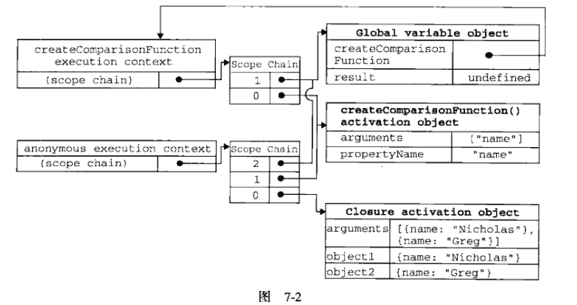

# JavaScript高级程序设计3

## 第七章 函数表达式

定义函数有两种方式：

- 1.函数声明：

```js
function functionName(arg0, arg1){
    //函数体
}
```

FireFox、Safari、Chrome和Opera都给函数定义了一个非标准的name属性，通过这个属性可以访问到给函数指定的名字。这个属性的值永远等于等在function关键字后面的表示符：

```js
console.log(functionName.name);
```

函数声明一个重要特征就是`函数声明提升`，意思是执行代码之前会先读取函数声明，即使把函数声明放在调用它的语句后面，也不会报错：

```js
sayHi();
function sayHi(){
    console.log('hi');
    //顺便测一下变量声明提升
    console.log(a);  //undefined
    console.log(b); //Uncaught ReferenceError: b is not defined
    var a = 1;
    console.log(a);  //1
}
```

- 2.函数表达式：

```js
var functionName = function(arg0, arg1){
    //函数体
}
```

这种形式就像是常规的变量赋值语句，即创建一个函数并将它赋值给变量functionName。这种情况下创建的函数叫做匿名函数（也叫拉姆达函数），因为function关键字后面没有标识符。匿名函数的name属性是空字符串。

函数表达式与其他表达式一样，在使用前必须先赋值：

```js
console.log(sayHi);  //undefined，从这里以及下面的报错可以看出，函数表达式执行的是变量声明提升，因为它并不是报的 sayHi is not defined 的错，而是因为undefined不是一个function。
sayHi();             //Uncaught TypeError: sayHi is not a function
var sayHi = function(){
    console.log('hi');
}
```

因为存在函数声明提升，所以不能执行以下代码：

```js
//不要这样做！！！
if(condition){
    function sayHi(){
        console.log('hi');
    }
}else{
    function sayHi(){
        console.log('yo');
    }
}
//这在ECMAScript中属于无效语法，js引擎会尝试修正错误。大多数浏览器会返回第二个声明，忽略condition；Firefox会在condition为true时返回第一个声明。
```

如果使用函数表达式，就可以实现上例中的效果：

```js
var sayHi;
if(condition){
    sayHi = function(){
        console.log('hi');
    }
}else{
    sayHi = function(){
        console.log('yo');
    }
}
```

另外，能够创建函数再赋值给变量，也就能够把函数作为其他函数的值返回：

```js
//第5章中的那个函数
function createComparisonFunction(propertyName){
    return function(object1, object2){
        var value1 = object1[prototypeName];
        var value2 = object2[prototypeName];
        if(value1 < value2){
            return -1;
        }else if(value1 > value2){
            return 1;
        }else{
            return 0;
        }
    }
}
```

createComparisonFunction()就返回了一个匿名函数。返回的函数可能会被赋值给一个变量，或者以其他方式被调用；不过，在createComparisonFunction()函数内部，它是匿名的。`在把函数当成值来使用的情况下，都可以使用匿名函数`。

---

### 7.1 递归

递归函数是在一个函数通过名字调用自身的情况下构成的：

```js
//经典的递归阶乘函数
function factorial(num){
    if(num <= 1){
        return 1;
    }else{
        return num * factorial(num-1);
    }
}
//但是存在一个问题
var anotherFactorial = factorial;
factorial = null;
console.log(anotherFactorial(4));  //Uncaught TypeError: factorial is not a function
```

以上代码先把factorial()函数保存在变量anotherFactorial中，然后将factorial变量设置为null，结果指向原始函数的引用只剩下一个（也就是anotherFactorial）。但在接下来调用anotherFactorial()时，由于必须执行factorial()，而factorial已经不再是函数，所以就会导致错误。在这种情况下，可以使用arguments.callee来解决这个问题。

`arguments.callee是一个指向正在执行的函数的指针`，因此可以用它来实现对函数的递归调用：

```js
function factorial(num){
    if(num <= 1){
        return 1;
    }else{
        return num * arguments.callee(num-1); //通过使用arguments.callee代替函数，可以确保无论怎样调用函数都不会出问题
    }
}
//上例问题被解决了
var anotherFactorial = factorial;
factorial = null;
console.log(anotherFactorial(4));  //24
```

但在严格模式下，不能通过脚本访问arguments.callee，访问这个属性会导致错误。不过，可以使用命名函数表达式来达成相同的结果：

```js
//最推荐这种方式实现递归
var factorial = (function f(num){
    if(num <=1){
        return 1;
    }else{
        return num * f(num-1);
    }
});
//上例问题被解决了
var anotherFactorial = factorial;
factorial = null;
console.log(anotherFactorial(4));  //24
```

上例创建了一个名为f()的命名函数表达式，然后将它赋值给变量factorial。即便把函数赋值给了另一个变量，函数的名字f仍然有效，所以递归调用照样能正确完成。这种方式在严格模式和非严格模式下都行得通。

---

### 7.2 闭包

不要弄混匿名函数和闭包的概念。**闭包**是指`有权访问另一个函数作用域中的变量的函数`。创建闭包的常见方式，就是在一个函数内部创建另一个函数：

```js
function createComparisonFunction(propertyName){
    return function(object1,object2){
        var value1 = object1[propertyName];//注意这两句代码
        var value2 = object2[propertyName];//注意这两句代码
        if(value1 < value2){
            return -1;
        }else if(value1 > value2){
            return 1;
        }else{
            return 0;
        }
    };
}
```

上例中，标注的两行代码是内部函数（一个匿名函数）中的代码，这两行代码访问了外部函数中的变量propertyName。即使这个内部函数被返回了，而且是在其他地方被调用了，但它仍然可以访问变量propertyName。之所以还能够访问这个变量，是因为内部函数的作用域链中包含createComparisonFunction()的作用域。要彻底搞清楚其中的细节，必须从理解函数第一次被调用的时候都会发生什么入手。

有关如何创建作用域链以及作用域链有什么作用的细节，对彻底理解闭包至关重要。

当某个函数第一次被调用时，会创建一个执行环境及相应的作用域链，并把作用域链赋值给一个特殊的内部属性（即[[Scope]]）。然后，使用this、arguments和其他命名参数的值来初始化函数的活动对象。但在作用域链中，外部函数的活动对象始终处于第二位，外部函数的外部函数的活动对象处于第三位......直至作为作用域链终点的全局执行环境。

在函数执行过程中，为读取和写入变量的值，就需要在作用域链中查找变量：

```js
function compare(value1, value2){
    if(value1 < value2){
        return -1;
    }else if(value1 > value2){
         return 1;
    }else{
        return 0;
    }
}
return result = compare(5, 10);
```

上例中先定义了compare()函数，然后又在全局作用域中调用了它。当第一次调用compare()时，会创建一个包含this、arguments、value1、value2的活动对象。全局执行环境的变量对象（包含this、result和compare）在compare()执行环境的作用域链中则处于第二位。如图：


后台的每个执行环境都有一个表示变量的对象--变量对象。全局环境的变量对象始终存在，而像compare()函数这样的局部环境的变量对象，则只在函数执行的过程中存在。在创建compare()函数时，会创建一个预先包含全局变量对象的作用域链，这个作用域链被保存在内部的[[Scope]]属性中。当调用compare()函数时，会为函数创建一个执行环境，然后通过复制函数的[[Scope]]属性中的对象构建起执行环境的作用域链。此后，又有一个活动对象（在此作为变量对象使用）被创建并被推入执行环境作用域链的前端。

对于例子中compare()函数的执行环境而言，其作用域链中包含两个变量对象：本地活动对象和全局变量对象。显然，作用域本质上是一个指向变量对象的指针列表，它只引用但不实际包含变量对象。

无论什么时候在函数中访问一个变量时，就会从作用域中搜索具有相应名字的变量。一般来讲，当函数执行完毕后，局部活动对象就会被销毁，内存中仅保存全局作用域（全局执行环境的变量对象）。但是，闭包的情况会不一样。

在另一个函数内部定义的函数会将包含函数（即外部函数）的活动对象添加到它的作用域链中。因此，在createComparisonFunction()函数内部定义的匿名函数的作用域链中，实际上将会包含外部函数createComparisonFunction()的活动对象。如图：



在匿名函数从createComparisonFunction()中被返回后，它的作用域链被初始化为包含createComparisonFunction()函数的活动对象和全局变量对象。这样，匿名函数就可以访问在createComparisonFunction()中定义的所有变量。更重要的是，createComparisonFunction()函数在执行完毕后，其活动对象也不会被销毁，因为匿名函数的作用域链仍然在引用这个活动对象。换句话说，当createComparisonFunction()函数返回后，其执行环境的作用域链会被销毁，但它的活动对象仍然会留在内存中；知道匿名函数被销毁后，createComparisonFunction()的活动对象才会被销毁：

```js
//创建函数
var compareNames = createComparisonFunction('name');
//调用函数
var resule = compareNames({name:'Nicholas'},{name:'Greg'});
//解除对匿名函数的引用（以便释放内存）
compareNames = null;
//通过将compareNames设置为等于null解除该函数的引用，就等于通知垃圾回收例程将其清除。随着匿名函数的作用域链被销毁，其他作用域（除了全局作用域）也偶读可以安全的销毁了。
```

**注意**：由于闭包会携带包含它的函数的作用域，因此会比其他函数占用更多的内存。过度使用闭包可能会导致内存占用过多，建议只在绝对必要时再考虑使用闭包。

#### 7.2.1 闭包与变量

作用域链的这种配置机制会引起一个值得注意的副作用：即闭包只能取得`包含函数中任何变量的最后一个值`。闭包所保存的是整个变量对象，而不是某个特殊的变量：

```js
function createFunctions(){
    var result = new Array();
    for(var i=0;i<10;i+=1){
        result[i] = function(){
            return i;
        };
    }
    return result;
}
```

这个函数会返回一个函数数组，表面上看，似乎每个函数都应该返回自己的索引值，即位置0的函数返回0，位置1的函数返回1，以此类推。但实际上，每个函数都返回10.因为每个函数的作用域链中都保存着createFunctions()函数的活动对象，所以它们引用的都是同一个变量i。当createFunctions()函数返回后，变量i的值是10，此时每个函数都引用着保存变量i的同一个变量对象，所以在每个函数内部i的值都是10。

通过创建另一个匿名函数强制让闭包的行为符合预期：

```js
function createFunctions()(){
    var result = new Array();
    for(var i=0;i<10;i+=1){
        //创建一个新的立即执行的匿名函数
        result[i] = function(num){
            //返回一个新的闭包，num值将是每次传进来的不同i值
            return function(){
                return num;
            };
        }(i);
    }
    return result;
}
```

在上例中，我们没有直接把闭包赋值给数组，而是定义了一个匿名函数，并将立即执行该匿名函数的结果赋值给数组。这里的匿名函数有一个参数num，也就是最终的函数要返回的值。在调用每个匿名函数时，我们传入了变量i。由于函数参数是按值传递的，所以就会将变量i的当前值复制给参数num。而在这个匿名函数内部，又创建并返回了一个访问num的闭包。这样一来，result数组中的每个函数都有自己num变量的一个副本，因此就可以返回各自不同的数值了。

#### 7.2.2 关于this对象

在闭包中使用this对象也可能会导致一些问题。this对象是在**运行时**基于函数的执行环境绑定的：在全局函数中，this等于window，而当函数被作为某个对象的方法调用时，this等于那个对象。不过，`匿名函数的执行环境具有全局性，因此其this对象通常指向window`（当然，在通过call()或apply()改变函数执行环境的情况下，this就会指向其他对象）。但有时候由于编写闭包的方式不同，这一点可能不会那么明显：

**注意**：是`匿名函数`的执行环境才具有全局性！！！

```js
var name = 'The Window';
var object = {
    name: 'My Object',
    getNameFunc: function(){
        return function(){
            return this.name;
        };
    }
};
console.log(object.getNameFunc()());  //'The Window'（非严格模式下）

var name = 'The Window';
var object = {
    name: 'My Object',
    getNameFunc: function(){
        //虽然这里的函数是一个闭包，但他在定义时并不是匿名函数，所以执行环境并没有全局性，
        //不信的话，看下一例
        console.log(this);  //{name: "My Object", getNameFunc: ƒ}
        //这里的返回一个匿名函数，也是一个闭包，所以具有全局性
        return function(){
            console.log(this); //Window {postMessage: ƒ, blur: ƒ, focus: ƒ, close: ƒ, frames: Window, …}
            return this.name;
        };
    }
};
console.log(object.getNameFunc()());  //'The Window'（非严格模式下）

var name = 'The Window';
var object = {
    name: 'My Object',
    getNameFunc: function(){
        console.log(this);  //{name: "My Object", getNameFunc: ƒ}
        return {
            name: 'getNameFunc Object',
            getNameFunc: function(){
                console.log(this);  //{name: "getNameFunc Object", getNameFunc: ƒ}
                console.log(this.name); //'getNameFunc Object'
                return function(){
                    console.log(this); //Window {postMessage: ƒ, blur: ƒ, focus: ƒ, close: ƒ, frames: Window, …}
                    return this.name;
                };
            }
        };
    }
};
console.log(object.getNameFunc().getNameFunc()());  //'The Window'（非严格模式下）


//对于构造函数而言
var name = 'The Window';
var object1 = function(){
    this.name='My Object';
    this.getName = function(){
        console.log(this);  //object1 {name: "My Object", getName: ƒ}
        return this.name;
    }
};
var a = new object1();
console.log(a.getName()); //'My Object'

var name = 'The Window';
var object1 = function(){
    this.name='My Object';
    this.getName = function(){
        return function(){
        console.log(this);  //Window {postMessage: ƒ, blur: ƒ, focus: ƒ, close: ƒ, frames: Window, …}
            return this.name;
        };
    }
};
var a = new object1();
console.log(a.getName()());//'The Window'
```

为什么匿名函数没有取得其包含作用域（或外部作用域）的this对象呢？

前面曾提过，每个函数在被调用时，其活动对象都会自动取得两个特殊变量：this和arguments。内部函数在搜索这两个变量时，`只会搜索到其活动对象为止，因此永远不可能直接访问外部函数中的这两个变量`。

*个人理解*：当函数不是匿名函数时，即被作为某个对象的方法（即属性）调用时，this等于那个对象；也就是说，他的活动对象包括了那个对象的活动对象（或者说，这个函数保存了一个对那个对象的活动对象的引用）。而匿名函数是直接执行的，所以不可能被当作对象的方法来调用了，活动对象也就只有自身的活动对象以及全局活动对象了。

不过，把外部作用域中的this对象保存在一个闭包能够访问到的变量里，就可以让闭包访问该对象了：

```js
var name = 'The Window';
var object = {
    name: 'My Object',
    getNameFunc: function(){
        //把this对象赋值给that变量，下面的闭包是可以访问这个变量的，因为他是我们在包含函数中特意声明的一个变量。即使在函数返回之后，that也仍然引用着object
        var that = this;
        return function(){
            return that.name;
        };
    }
};
console.log(object.getNameFunc()());  //'My Object'
//构造函数的改法一样
```

**注意**：this和arguments也存在同样的问题，如果想访问作用域中的arguments对象，必须将对该对象的引用保存到另一个闭包能够访问的变量中。

在几种特殊情况下，this的值可能会意外地改变：

```js
var name = 'The Window';
var object = {
    name: 'My Object',
    //这里的getName()方法只是简单的返回this.name的值
    getName: function(){
        return this.name;
    }
};
console.log(object.getName());  //'My Object'；this.name就是object.name
console.log((object.getName)());  //'My Object'；虽然加上了括号之后，就好像是在引用一个函数，但是this的得得到了维持，因为object.getName和(object.getName)的定义是相同的
console.log((object.getName=object.getName)());  //'The Window'，在非严格模式下；先执行了一条赋值语句，然后再调用赋值后的结果。因为这个赋值表达式的值是函数本身，所以this的值得不到维持
```

#### 7.2.3 内存泄漏

由于IE9之前的版本对JScript对象和COM对象使用不同的垃圾收集例程（见第4章），因此闭包在IE的这些版本中会导致一些特殊的问题。具体来说，`如果闭包的作用域链中保存着一个HTML元素，那么就意味着该元素将无法被销毁`：

```js
function assignHandler(){
    var element = documen.getElementById('someElement');
    element.onclick = function(){
        console.log(element.id);
    };
}
```

上例中创建了一个作为element元素事件处理程序的闭包，而这个闭包则又创建了一个循环引用。由于匿名函数保存了一个对assignHandler()的活动对象的引用，因此就会导致无法减少element的引用数。只要匿名函数存在，element的引用数至少也是1，因此它所占用的内存就永远不会被回收。这个问题可以调整代码来解决：

```js
function assignHandler(){
    var element = document.getElementById('someElement');
    var id = element.id;
    element.onclick = function(){
        console.log(id);
    };
    element = null;
}
```

通过把element.id的`一个副本`保存在一个变量中，并且在闭包中引用该变量消除了循环引用。但仅仅做到这一步，还是不能解决内存泄漏的问题。必须要记住：**闭包会引用包含函数的整个活动对象**，而其中包含着element。即使闭包不直接引用element，包含函数的活动对象中也仍然会保存一个引用。因此，有必要把element变量设置为null。这样就能够接触对DOM对象的引用，顺利地减少其引用数，确保正常回收其占用的内存。

---

### 7.3 模仿块级作用域

js没有块级作用域的概念，即使在块语句中定义的变量，实际上也是在包含函数中而非语句中创建的：

```js
function numbers(count){
    for(var i=0;i<count;i+=1){
        console.log(i);
    }
    console.log(i);
}
//在js中，变量i是定义在numbers()的活动对象中的，因此从它有定义开始，就可以在函数内部随处访问他。即使像下面这样错误的重新声明同一个变量，也不会改变他的值：
function numbers(count){
    for(var i=0;i<count;i+=1){
        console.log(i);
    }
    var i;
    console.log(i);
}
```

js从来不会告诉我们是否多次声明了同一个变量，遇到这种情况，它只会对后续的声明视而不见（不过，它会执行后续声明中的变量初始化）--因为变量声明提升。

匿名函数可以用来模仿块级作用域。用作块级作用域（也叫私有作用域）的匿名函数的语法：

```js
(function(){
    //这里是块级作用域
})();

function(){
    //这里是块级作用域
}();//出错！因为js将function关键字当作一个函数声明的开始，而函数声明后面不能跟圆括号。而函数表达式可以跟圆括号。

//将函数声明转换成函数表达式，只要给它加上一对圆括号即可：
//这是函数声明
function(){
    //这里是块级作用域
}
//这是函数表达式
(function(){
    //这里是块级作用域
})
```

```js
function numbers(count){
    (function(){
        for(var i=0;i<count;i+=1){
            console.log(i);
        }
    })();
    //在匿名函数中定义的任何变量，都会在执行结束时被销毁。
    console.log(i);//导致一个错误！！
}
```

这种技术经常在全局作用域中被用在函数外部，从而限制向全局作用域中添加过多的变量和函数。

**补充**：这种做法可以减少闭包占用的内存问题，因为没有指向匿名函数的引用。只要函数执行完毕，就可以立即销毁其作用域链了。

---

### 7.4 私有变量

严格来讲，js中没有私有成员的概念，所有对象属性都是公有的。不过，倒是有一个私有变量的概念。任何在函数中定义的变量，都可以认为是私有变量，因为不能在函数外部访问这些变量。私有变量包括函数的参数、局部变量和在函数内部定义的其他函数：

```js
function add(num1, num2){
    var sum = num1 + num2;
    return sum;
}
```

三个私有变量：num1、num2和sum。函数外部不能访问它们。如果在这个函数内部创建一个闭包，那么闭包通过自己的作用域链也可以访问这些变量。利用这一点，就可以创建用于访问私有变量的共有方法。

我们把有权访问私有变量和私有函数的公有方法成为`特权方法`。有两种在对象上创建特权方法的方式：

- 1.在构造函数中定义特权方法，基本模式如下：

```js
function MyObject(){
    //私有变量和私有函数
    var privateVariable = 10;
    function privateFunction(){
        return false;
    }
    //特权方法
    this.publicMethod = function(){
        privateVariable++;
        return privateFunction();
    };
}
```

利用私有和特权成员，可以隐藏那些不应该被直接修改的数据：

```js
function Person(name){
    this.getName = function(){
        return name;
    };
    this.setName = function(value){
        name = value;
    };
}
var person = new Person('Nicholas');
console.log(person.getName()); //'Nicholas'
person.setName('Greg');
console.log(person.getName()); //'Greg'
```

由于这两个特权方法是在构造函数内部定义的，他们作为闭包能够通过作用域链访问name。私有变量name在Person的每一个实例中都不相同，因为每次调用构造函数都会重新创建这两个方法。不过，在构造函数中定义特权方法也有一个缺点，那就是针对每个实例都会创建同样的一组新方法，而使用静态私有变量来实现特权方法就可以避免这个问题。

#### 7.4.1 静态私有变量

通过在私有作用域中定义私有变量或函数，同样可以创建特权方法。其基本模式如下：

```js
(function(){
    //私有变量和私有函数
    var privateVariable = 10;
    //使用函数声明，创建局部函数
    function privateFunction(){
        return false;
    }
    //构造函数
    //使用函数表达式，创建全局函数；在严格模式下给未经声明的变量赋值会导致错误。
    MyObject = function(){
    };
    //公有/特权方法
    MyObject.prototype.publicMethod = function(){
        privateVariable++;
        return privateFunction();
    };
})();
```

这个模式创建了一个私有作用域，并在其中封装了一个构造函数及相应的方法。这个模式与在构造函数中定义特权方法的主要区别，就在于私有变量和函数是由实例共享的。由于特权方法是在原型上定义的，因此所有实例都使用同一个函数。而这个特权方法，作为一个闭包，总是保存着对包含作用域的引用：

```js
(function(){
    var name = '';
    Person = function(value){
        name = value;
    };
    Person.prototype.getName = function(){
        return name;
    };
    Person.prototype.setName = function(value){
        name = value;
    };
})();
var person1 = new Person('Nicholas');
console.log(person1.getName()); //'Nicholas'
person1.setName('Greg');
console.log(person1.getName()); //'Greg'
var person2 = new Person('Michael');
console.log(person1.getName()); //'Michael'
console.log(person2.getName()); //'Michael'
```

在这个例子中的Person构造函数与getName()和setName()一样，都有权访问私有变量name。在这种模式下，变量name就变成了一个静态的、由所有实例共享的属性。结果就是所有实例都会返回相同的值。

**PS**：以这种方式创建静态私有变量会因为使用原型而增进代码复用，但每个实例都没有自己的私有变量。至于是使用实例变量，还是静态私有变量，最终视需求而定。

**注意**：多查找作用域链中的一个层次，就会在一定程度上影响查找速度。而这正是使用闭包和私有变量的要给明显不足之处。

#### 7.4.2 模块模式

前面的模式是用于为自定义类型创建私有变量和特权方法的。而模块模式则是为单例创建私有变量和特权方法。所谓单例，指的就是只有一个实例的对象。js是以对象字面量的方式来创建单例对象的：

```js
var singleton = {
    name: value,
    method: function(){
        //这里是方法的代码
    }
};
```

模块模式通过为单例添加私有变量和特权方法能够使用其得到增强，其语法形式如下：

```js
var singleton = function(){
    var privateVariable = 10;
    function privateFunction(){
        return false;
    }
    return {
        publicProperty: true,
        publicMethod: function(){
            privateVariable++;
            return privateFunction();
        }
    };
}();
```

这个模块模式使用了一个返回对象的匿名函数，将一个对象字面量作为函数的值返回。返回的对象字面量中只包含可以公开的属性和方法。从本质上讲，这个对象字面量定义的是单例的公共接口。这种模式在需要对单例进行某些初始化，同时又需要维护其私有变量时时非常有用的：

```js
//创建了一个用于管理组件的application对象
var application = function(){
    var components = new Array();
    //初始化，向数组中添加了一个BaseComponent的新实例（在这里不需要关心BaseComponent的的代码，我们只是用它来展示初始化操作）
    components.push(new BaseComponent());
    return {
        //只返回已注册的组件数目
        getComponentCount: function(){
            return components.length;
        },
        //用于注册新组件
        registerComponent: function(component){
            if(typeof component == 'object'){
                components.push(component);
            }
        }
    };
}();
```

**注意**：如果必须创建一个对象并以某些数据对其进行初始化，同时还要公开一些能够访问这些私有数据的方法，那么久可以使用模块模式。

以这种模式创建的每个单例都是Object的实例，因为最终要通过一个对象字面量来表示它。不过，这也没什么；毕竟，单例通常都是作为全局对象存在的，我们不会将它传递给一个函数。因此，也就没什么必要使用instanceof操作符来检查其对象类型了。

#### 7.4.3 增强的模块模式

在模块模式中，在返回对象之前加入对其增强的代码。这种增强的模块模式适合那些单例必须是某种类型的实例，同时还必须添加某些属性和（或）方法对其加以增强的情况：

```js
var singleton = function(){
    var privateVariable = 10;
    function privateFunction(){
        return false;
    }
    //创建对象
    var object = new CustomType();
    //添加特权/公有属性和方法
    object.publicProperty = true;
    object.publicMethod = function(){
        privateVariable++;
        return privateFunction();
    };
    //返回这个对象
    return object;
}();
```

如果前面的模块模式例子中的application对象必须是BaseComponent的实例，那么就可以这样：

```js
var application = function(){
    var components = new Array();
    components.push(new BaseComponent());
    //创建application的一个局部副本
    var app = new BaseComponent();
    //公共接口
    app.getComponentCount = function(){
        return components.length;
    };
    app.registerComponent = function(component){
        if(typeof component == 'object'){
            components.push(component);
        }
    };
    //返回这个副本
    return app;
}();
```

---

### 7.5 小结

在js编程中，函数表达式是一种非常有用的技术。使用函数表达式可以无须对函数命名，从而实现动态编程。匿名函数（拉姆达函数）是一种使用js函数的强大方法。以下总结函数表达式的特点：

1. 函数表达式不同于函数声明。函数声明要求有名字，但函数表达式不需要。没有名字的函数表达式也叫做匿名函数。
2. 在无法确认如何引用函数的情况下，递归函数就会变得比较复杂；
3. 递归函数应该始终使用arguments.callee来递归地调用自身，不要使用函数名--函数名可能会发生改变。

当在函数内部定义了其他函数时，就创建了闭包。闭包有权访问包含函数内部的所有变量，原理如下：

1. 在后台执行环境中，闭包的作用域链包含着它自己的作用域、包含函数的作用域和全局作用域。
2. 通常，函数的作用域及其所有变量都会在函数执行结束后被销毁。
3. 但是，当函数返回了一个闭包时，这个函数的作用域将会一直在内存中保存到闭包不存在为止。

使用闭包可以在js中模仿块级作用域，要点如下：

1. 创建并立即调用一个函数，这样既可以执行其中的代码，又不会在内存中留下对该函数的引用。
2. 结果就是函数内部的所有变量都会被立即销毁--除非将某些变量赋值给了包含作用域（即外部作用域）中的变量。

闭包还可以用于在对象中创建私有变量，相关概念和要点如下：

1. 即使js中没有正式的私有对象属性的概念，但可以使用闭包来实现公有方法，而通过公有方法可以访问在包含作用域中定义的变量。
2. 有权访问私有变量的公有方法叫做特权方法。
3. 可以使用构造函数模式、原型模式来实现自定义类型的特权方法，也可以使用模块模式、增强的模块模式来实现单例的特权方法。

js中的函数表达式和闭包都是极其有用的特性，利用它们可以实现很多功能。不过，因为创建闭包必须维护额外的作用域，所以过度使用它们可能会占用大量内存。