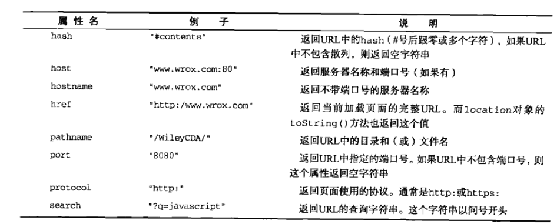

# JavaScript高级程序设计3

## 第八章 BOM

ECMAScript是js的核心，但如果要在Web中使用js，那么BOM（浏览器对象模型）无疑才算是真正的核心。

### 8.1 window对象

BOM的核心对象是window，它表示浏览器的一个实例。在浏览器中，window对象有双重角色，它既是通过js访问浏览器窗口的一个借口，优势ECMAScript规定的Global对象。这意味着在网页中定义的任何一个对象、变量和函数，都以window作为其Global对象，因此有权访问pareseInt()等方法。

#### 8.1.1 全局作用域

所有在全局作用域中声明的变量、函数都会变成window对象的属性和方法。不过，定义全局变量与在window对象上直接定义属性还是有一点区别的：全局变量不能通过delete操作符删除，而直接在window对象上定义的属性可以：

```js
var age = 29;
window.color = 'red';
console.log(color);  //'red'；与window.color是一样的
console.log(window);
delete window.age;  //在IE<9时抛出错误，在其他浏览器中都返回false
delete window.color;//在IE<9时抛出错误，在其他浏览器中都返回true
console.log(window.age); //29
console.log(window.color);//'undefined'
```

上例中使用var语句添加的window属性有一个名为[[Configurable]]的特性，这个特性的值被设置为false，因此这样定义的属性不可以通过delete操作符删除。IE8及更早版本在遇到使用delete删除window属性的语句时，不管该属性最初是如何创建的，都会抛出错误，以示警告。IE9及更高版本不会抛出错误。

另外，尝试访问未声明的变量都会抛出错误，但是通过查询window对象，可以知道某个可能未声明的变量是否存在：

```js
//这里会抛出错误，因为oldValue未定义
var newValue = oldValue;
//这里不会抛出错误，因为这是一次属性查询
var newValue = window.oldValue;
```

**兼容性**：Windows Mobile平台的IE浏览器不允许通过window.property = value之类的形式，直接在window对象上创建新的属性或方法。可是，在全局作用域中声明的所有变量和函数，照样会变成window对象的成员。

#### 8.1.2 窗口关系及框架

如果页面中包含框架，则每个框架都拥有自己的window对象，并且保存在frames集合中。在frames集合中，可以通过数值索引（从0开始，从左至右，从上至下）或者框架名称来访问相应的window对象。`每个window对象都有一个name属性`，其中包含框架的名称：

```html
<html>
    <head>
        <title>Frameset Example</title>
    </head>
    <frameset rows="160,*">
        <frame src="frame.htm" name="topFrame">
        <frameset rows="160,*">
            <frame src="frame1.htm" name="leftFrame">
            <frame src="frame2.htm" name="rightFrame">
        </frameset>
    </frameset>
</html>
```

上例中，可以通过window.frames[0]或者window.frames["topFrame"]来引用上方的框架。但是最好使用top.frames[0]而非window来引用这些框架。

`top对象`始终指向最高（最外）层的框架，也就是浏览器窗口。使用它可以确保在一个框架中正确地访问另一个框架。因为对于在一个框架中编写的任何代码来说，其中的window对象指向的都是那个框架的特定实例，而非最高层的框架。

与top相对的另一个window对象是`parent`。parent（父）对象始终指向当前框架的直接上层框架。在某些情况下，parent有可能等于top；但在没有框架的情况下，parent一定等于top（此时他们都等于window）：

```html
<html>
    <head>
        <title>Frameset Example</title>
    </head>
    <frameset rows="160,*">
        <frame src="frame.htm" name="topFrame">
        <frameset cols="50%,50%">
            <frame src="frame1.htm" name="leftFrame">
            <frame src="frame2.htm" name="rightFrame">
        </frameset>
    </frameset>
</html>
<!-- rightFrame框架集包含了另一个框架集 -->
<html>
    <head>
        <title>rightFrame Example</title>
    </head>
    <frameset cols="50%,50%">
            <frame src="frame2-1.htm" name="right1Frame">
            <frame src="frame2-2.htm" name="right2Frame">
        </frameset>
</html>
```

浏览器在加载完第一个框架集后，会继续将第二个框架集加载到rightFrame中。如果代码位于right1Frame（或者right2Frame）中，那么parent对象指向的就是rightFrame。如果代码位于topFrame中，则parent指向的是top，因为topFrame的直接上层框架就是最外层框架。

**注意**：除非最高层窗口是通过window.open()打开的，否则其window对象的name属性不会包含任何值（=""）。

与框架有关的最后一个对象是`self`，它始终指向window；实际上self和window对象可以互换使用。引入self对象的目的只是为了与top和parent对象相应起来，因此它不格外包含其他值。

所有这些对象都是window对象的属性，可以通过window.parent、window.top等形式来访问。同时，也可以将不同层次的window对象连缀起来，例如：windo.parent.parent.frames[0]。

**注意**：在使用框架的情况下，浏览器中会存在多个Global对象。在每个框架中定义的全局变量会自动成为框架中的window对象的属性。由于每个window对象都包含原生类型的构造函数，因此每个框架都有一套自己的构造函数，这些构造函数一一对应，但并不相等。例如，top.Object并不等于top.frames[0].Object。这个问题会影响到对跨框架传递的对象使用instanceof操作符。

#### 8.1.3 窗口位置

用来确定和修改window对象位置的属性和方法：IE、Safari、Opera和Chrome都提供了`screenLeft`和`screenTop`属性，分别用于表示窗口相对于屏幕左边和上边的位置。FireFox则在`screenX`和`screenY`属性中提供相同的窗口位置信息。Safari和Chrome也同时支持者两个属性，Opera虽然支持，但属性与screenLeft和screenTop属性并不对应，不建议再Opera中使用：

```js
var leftPos = (typeof window.screenLeft == 'number') ? window.screenLeft : window.screenX;
var topPos = (typeof window.screenTop == 'number') ? window.screenTop : window.screenY;
```

**注意**：无法在跨浏览器的条件下取得窗口左边和上边的精确坐标值。详情见本节。

使用`moveTo()`和`moveBy()`方法倒是有可能将窗口精确的移动到一个新位置。这两个方法都接收两个参数，其中moveTo()接收的是新位置的x和y坐标值，而moveBy()接收的是在水平和垂直方向上移动的像素数：

```js
window.moveTo(0,0); //将窗口移动到屏幕左上角
window.moveBy(0.100);//将窗口向下移动100像素
window.moveTo(200,300);//将窗口移动到(200,300)
window.moveBy(-50,0);//将窗口向左移动50像素
```

**注意**：这两个方法可能会被浏览器金庸；而且，在Opera和IE7（及更高版本呢）中默认就是禁用的。另外，这两个方法都不适用于框架，只能对最外层的windoww对象使用。

#### 8.1.4 窗口大小

#### 8.1.5 导航和打开窗口

`window.open()`，即可以导航到一个特定的URL，也可以打开一个新的浏览器窗口。接收四个参数：要加载的URL、窗口目标、一个特性字符串以及一个表示新页面是否取代浏览器历史记录中当家加载页面的布尔值。通常个只须传递第一个参数，最后一个参数只在不打开新窗口的情况下使用。

如果传递了第二个参数，而且该参数是已有窗口或框架的名称，那么就会在具有该名称的窗口或框架中加载第一个参数指定的URL。

#### 8.1.6 间歇调用和超时调用

`setTimeout()`

`setInterval()`

#### 8.1.7 系统对话框

`alert()`、`confirm()`、`prompt()`

---

### 8.2 location对象

`location`是最有用的BOM对象之一，它提供了与当前窗口中加载的文档有关的信息，还提供了一些导航功能。事实上，location对象，既是window对象的属性，也是document对象的属性；换句话说，window.location和document.location引用的是同一个对象。location对象的用处不只表现在它保存着当前文档的信息，还表现在它将URL解析为独立的片段，让开发人员可以通过不同的属性访问这些片段。

location对象的所有属性：

#### 8.2.1 查询字符串参数

`location.search`

#### 8.2.2 位置操作

`location.assign()`

`location.href`

---

### 8.3 navigator对象

---

### 8.4 screen对象

---

### 8.5 history对象

---

### 8.6 小结

