#### 一、实现功能：
1. 支持到最小时间单位：月、周、日、时、分、秒；
2. 起始日期和结束日期，其他日期禁止选择；
3. 自定义每周由星期几开始；
4. 推荐日期段；
5. 时间刷新间隔;
6. 日期顶部有月份、年份编辑的组件；
7. 日期界面顶部直接内嵌选择模式；
8. 日期支持时、分、秒时，底部出现time编辑的组件。

#### 二、所需界面
1. 选择年: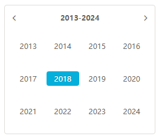；
2. 选择月: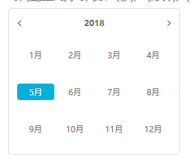；
3. 选择周: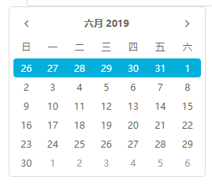；
4. 选择日期: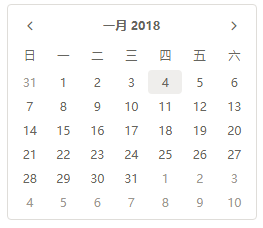；
5. 选择 时/分/秒: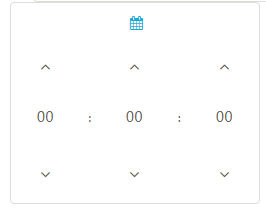；
6. 选择准确时: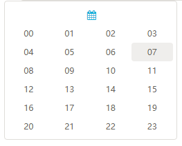；
7. 选择准确 分/秒: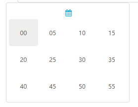；
8. 模式选择 组件；（用户有输入该参数时放在界面最顶部）: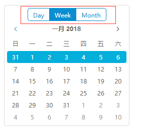；
9. 编辑time 组件；（支持时、分、秒时放在最底部）: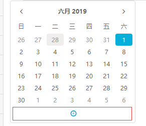；
10. 编辑date 组件；（编辑月、周、日、时、分、秒时放在页面最顶部）: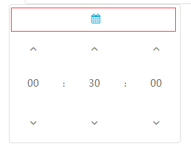；
11. 嵌入输入框中；（鼠标放上去或是点击之后展现出）：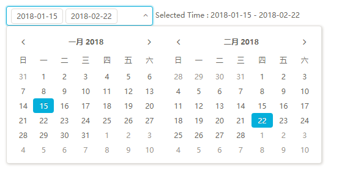。

#### 三、状态控制
1. tr_active  --周激活；
2. td_active  --日期激活；
3. old        --当前月份前的日期；
4. new        --当前月份后的日期；
5. disabled   --禁用时间段以外的日期；
6. expect-day --推荐日期；
7. hover      --鼠标的hover状态；
8. avtive     --鼠标的点击状态；

#### 四、用户输入
|Name              |Type                |默认值  |描述        |
|:---|:----|:----|:----|
|model             |TimeType/string      |date   |支持的最小粒度|
|limitEnd          |Time                 |-      |结束日期|
|limitStart        |Time                 |-      |起始日期|
|refreshInterval   |number               |--     |时间刷新的间隔毫秒数，主要针对startDate或endDate设置为now或now-2h等需要不时刷新的场景|
|weekStart         |string/TimeWeekStart |sun    |每周由星期几开始|
|selectItems       | TypeItem[]          |-      |picker支持切换的模式|
|recommendedBegin  |Time                 |-      |推荐开始日期|
|recommendedEnd    |Time                 |-      |推荐结束日期|

#### 五、数据类型

- TimeType
```
export enum TimeType {
    second, minute, hour, date, week, month
}
```
- Time
```
export type Time = Date|string;
```

- TimeWeekStart
```
export enum TimeWeekStart {
    sun, mon, tue, wed, thu, fri, sat
}
```

- TypeItem
```
export class TypeItem {
    label: string;
    value: TimeType;
}
```
