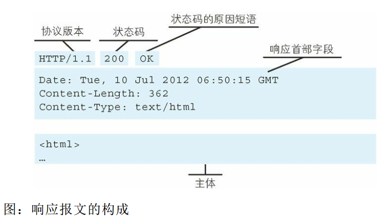
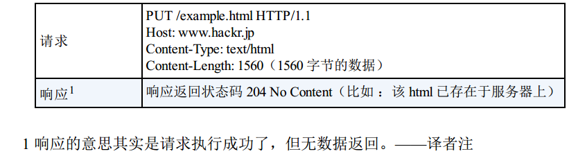

## 第一章 了解Web及网络基础

### 1.3 网络基础TCP/IP

#### 1.3.1 TCP/IP协议族
计算机与网络设备要相互通信，双方就必须基于相同的方法，所有的一切都需要一种规则，而我们把这种规则称为协议。把与互联网相关联的协议集合起来总称为TCP/IP（也有说法认为，TCP/IP是指TCP和IP这两种协议）。

#### 1.3.2 TCP/IP的分层管理
协议簇按层次分为：应用层、传输层、网络层、数据链路层。

- 应用层：决定了向用户提供应用服务时通信的活动。TCP/IP协议簇内预存了各类通用的应用服务，--FTP、DNS等；HTTP协议也处于该层。
- 传输层：传输层对上层应用层，提供处于网络连接中的两台计算机之间的数据传输。有两个性质不同的协议：TCP（传输控制协议）和UDP（用户数据报协议）。
- 网络层（网络互连层）：用来处理在网络上流动的数据包。
- 链路层（数据链路层、网络接口层）：用来处理连接网络的硬件部分。包括控制操作系统、硬件的设备驱动、NIC（网络适配器，即网卡）、光纤等物理可见部分。

#### 1.3.3 TCP/IP通信传输流
利用TCP/IP协议簇进行网络通信时，会通过分层顺序与对方进行通信。发送端从应用层往下走，接收端则往应用层往上走。


用HTTP举例：

    1. 作为发送端的客户端在应用层（HTTP协议）发出一个想看某个web页面的http请求；
    2. 在传输层（TCP协议）把从应用层处收到的数据（HTTP请求报文）进行分割，并在各个报文上打上标记序号及端口号后转发给网络层；
    3. 在网络层（IP协议），增加作为通信目的地的MAC地址后转发给链路层；
    4. 接收端的服务器在链路层接收到数据，按序往上层发送，一直到应用层。至此，才能算真正接收到由客户端发送过来的HTTP请求。


发送端在层与层之间传输数据时，每经过一层时必定会被打上一个该层所属的首部信息。反之，接收端在层与层传输数据时，每经过一层时会把对应的首部消去。

### 1.4 与HTTP关系密切的协议：IP、TCP、和DNS
#### 1.4.1 负责传输的IP协议
 IP间的通信依赖MAC地址，通常经过多台计算机和网络设备中转才能连接到对方。而在进行中转时，会利用下一站中转设备的MAC地址来搜索下一个中转目标。这种机制称为路由选择。

 

 #### 1.4.2 确保可靠性的TCP协议
 字节流服务：为了方便传输，将大块数据分割成以报文段为单位的数据包进行管理。
 
 为了准确无误地将数据送达目标处，TCP协议采用了三次握手策略。----发送端首先发送一个带SYN标志的数据包给对方；接收端收到后，回传一个带有SYN/ACK标志的数据包以示传达确认信息；最后，发送端再回传一个带有ACK标志的数据包，代表“握手”结束。（若在握手过程中某个阶段莫名中断，TCP协议会再次以相同的顺序发送相同的数据包）


### 1.5 负责域名解析的DNS服务

DNS提供域名到IP地址之间的解析服务。计算机既可以被赋予IP地址，也可以被赋予主机名和域名。用户通常使用便于记忆的主机名或域名来访问对方的计算机，但计算机更擅长助理IP地址那样的一长串数字。DNS服务便应运而生，DNS协议提供通过域名查找IP地址，或逆向从IP地址反查域名的服务。


### 1.6 各种协议与HTTP协议的关系


### 1.7 URI（统一资源标识符）和URL（统一资源定位符）
#### 1.7.1 统一资源标识符
URI是由某个协议方案表示的资源的定位标识符，协议方案是指访问资源使用的协议类型名称。

采用HTTP协议时，协议方案就是http。初次之外，还有ftp、mailto、telnet、file等30种左右的标准的URI协议方案。

URI用字符串标识某一互联网资源，而URL表示资源的地点（互联网上所处的位置），可见URL是URI的子集。

#### 1.7.2 URI格式


- 使用http:或https:等协议方案名获取访问资源时要指定协议类型（不区分字母大小写，最后附一个`:`）；
- 登录信息（认证）：指定用户名和密码作为从服务器端获取资源时必要的登录信息（身份认证），此项是可选项；
- 服务器地址：使用绝对URI必须指定待访问的服务器地址，地址可以是类似hackr.jp这种DNS可解析的名称，或是192.168.1.1这类IPv4地址名，也可以是[0:0:0:0:0:0:0:1]这样用方括号括起来的IPv6地址名；
- 服务器端口号：指定服务器连接的网络端口号，可选，省略则自动使用默认端口号；
- 带层次的文件路径：指定服务器上的文件路径来定位特指的资源；
- 查询字符串：针对已指定的文件路径内的资源，可以使用查询字符串传入任意参数，可选；
- 片段标识符：使用片段标识符通常可标记出已获取资源中的子资源（文档内的某个位置），但在RFC中并没有明确规定其使用方法，可选。

---
## 第二章简单的HTTP协议
只要使用HTTP/1.1版本
### 2.1 HTTP协议用于客户端和服务器端之间的通信
请求访问文本或图像等资源的一端成为客户端，而提供资源响应的一端称为服务器端。

### 2.2 通过请求和响应的交换达成通信
#### 2.2.1 请求


- GET/POST：请求访问服务器的类型，称为方法（method）；
- /form/entry：请求访问的资源对象，也叫做请求URI;
- HTTP/1.1：HTTP的版本号，用来提示客户端使用的HTTP协议功能；

这段请求内容的意思是：请求访问某台HTTP服务器上的/form/entry资源。

请求报文是由请求方法、请求URI、协议版本、可选的请求首部字段和内容实体构成的。

#### 2.2.2 响应


- HTTP/1.1：服务器对应的HTTP版本；
- 200 OK：请求的处理结果的状态码（status code）和原因短语（reason-phrase）；
- Date：创建响应的日期时间，是首部字段内的一个属性；
- 接着以一空行分割，之后的内容称为资源实体的主体。

响应报文基本上由协议版本、状态码（表示请求成功或失败的数字代码）、用以解释状态码的原因短语、可选的响应首部字段以及实体主体构成。

### 2.3 HTTP是不保存状态的协议
使用HTTP协议，每当有新的请求发送时，就会有对应的新响应产生。协议本身并不保留之前一切的请求或响应报文。这是为了更快地处理大量事务，确保协议的可伸缩性，而特意把HTTP协议设计成如此简单的。

HTTP/1.1虽然是无状态协议，但为了实现期望的保持状态功能（比如保持登录状态），于是引入了Coolie技术。

### 2.4 请求URI定位资源
当客户端请求访问资源而发送请求时，URI需要将作为请求报文中的请求URI包含在内。指定请求URI的方式有很多：


另外，如果不是访问特定资源而是对服务器本身发起请求，可以用一个*来代替请求URI。
```
查询HTTP服务器端支持的HTTP方法种类：
OPTIONS * HTTP/1.1
```

### 2.5 告知服务器意图的HTTP方法
HTTP/1.1中可使用的方法：
#### 2.5.1 GET：获取资源
用来请求已被URI识别的资源，指定的资源经服务器端解析后返回响应内容。如果请求的资源是文本，就保持原样返回；如果是像CGI（通用网关接口）那样的程序，则返回经过执行后的输出结果。


#### 2.5.2 POST:传输实体主体
虽然用GET方法也可以传输实体的主体，但一般都用POST方法。


#### 2.5.3 PUT：传输文件
就像FTP协议的文件上传一样，要求在请求报文的主体中包含文件内容，然后保存到请求URI指定的位置。但是因为HTTP/1.1的PUT方法自身不带验证机制，任何人都可以上传文件，存在安全性问题，因此一把的web网站不使用该方法。



#### 2.5.4 HEAD：获得报文首部
HEAD方法和GET方法一样，只是不返回报文主体部分，用于确认URI的有效性及资源更新的日期时间等。


#### 2.5.5 DELETE：删除文件
按请求URI删除指定的资源，但是和PUT方法一样不带验证机制，所以一般web网站也不使用DELETE方法。


#### 2.5.6 OPTIONS：询问支持的方法
OPTIONS方法用来查询针对请求URI指定的资源支持的方法。


#### 2.5.7 TRACE：追踪路径
TRACE方法是让web服务器端将之前的请求通信环回给客户端的方法。它容易引起XST（跨站追踪）攻击，一般不会用到。

#### 2.5.8 CONNECT：要求用隧道协议连接代理
CONNECT方法要求在与代理服务器通信时建立隧道，实现用隧道协议进行TCP通信。主要使用SSL（安全套接层）和TLS（传输层安全）协议把通信内容加密后经网络隧道传输。


### 2.7 持久连接节省通信量
#### 2.7.1 持久连接
持久连接的特点是：只要任意一端没有明确提出断开连接，则保持TCP连接状态。旨在建立1次TCP连接后进行多次请求和响应的交互。

好处在于减少了TCP连接的重复建立和断开所造成的额外开销，减轻了服务器端的负载。另外，减少开销的那部分时间，使HTTP请求和响应能够更早的结束，这样web页面的显示速度也就相应提高了。

#### 2.7.2 管线化
持久连接使得多数请求以管线化方式发送成为可能，发送请求后不用等待响应亦可直接发送下一个请求。这样就能做到同时并行发送多个请求，而不需要一个接一个地等待响应了。

### 2.8 使用Cookie的状态管理
Cookie会根据从服务器端发送的响应报文内的一个叫做Set-Cookie的首部字段信息，通知客户端保存Cookie，当下次客户端再往该服务器发送请求时，客户端会自动在请求报文中加入Cookie值后发送出去。服务器端发现客户端发送过来的Cookie后，会去检查究竟是从哪一个客户端发来的连接请求，然后对比服务器上的记录，最后得到之前的状态信息。

---

## 第三章 HTTP报文内的HTTP信息
`HTTP通信过程`包括从客户端发往服务器端的请求及从服务器端返回客户端的响应。

### 3.1 HTTP报文
用于HTTP协议交互的信息被称为HTTP报文--请求报文、响应报文。

HTTP报文大致分为：报文首部、报文主体（可选）两块。通过空行（CR+LF）来划分。

### 3.2 请求报文及响应报文的结构


- 请求行：包含用于请求的方法，请求URI和HTTP版本；
- 状态行：包含表明响应结果的状态码，原因短语和HTTP版本；
- 首部字段：包含表示请求和响应的各种条件和属性的各类首部--通用首部、请求首部、响应首部、实体首部；
- 其他：可能包含HTTP的RFC里未定义的首部（Cookie等）。

### 3.3 编码提升传输速率
#### 3.3.1 报文主体和实体主体的差异
- 报文（message）：是HTTP通信中的基本单位，由8位组字节流组成，通过HTTP通信传输；
- 实体（entity）：作为请求或响应的有效载荷数据（补充项）被传输，其内容由实体首部和实体主体组成。

HTTP报文的主体用于传输请求或响应的实体主体。

通常，报文主体等于实体主体，但是当传输中进行编码操作时，实体主体的内容发生变化，才导致它和报文主体产生差异。

#### 3.3.2 压缩传输的内容编码
内容编码指明应用在实体内容上的编码格式，并保持实体信息原样压缩，内容编码后的实体由客户端接收并负责解码。

常用的内容编码：
- gzip(GNU zip);
- compress(UNX系统的标准压缩)；
- deflate(zlib);
- identity(不进行编码)。

#### 3.3.3分割发送的分块传输编码
在HTTP通信过程中，请求的编码实体资源尚未全部传输完成之前，浏览器无法显示请求页面。在传输大容量数据时，通过把数据分割成多块，能够让浏览器逐步显示页面。这种把实体主体分块的功能称为分块传输编码。

### 3.4 发送多种数据的多部分对象集合
多部分对象集合（Multipart）；发送的一份报文主体内可含有多类型实体：
- multipart/form-data;
- multipart/byteranges;

在HTTP报文中使用多部分对象集合时，需要在首部字段里加上Content-type。
```
Content-Type:multipart/byteranges;
```

### 3.5 获取部分内容的范围请求


执行范围请求时，会用到首部字段Range来指定资源的byte范围。
byte范围的指定形式如下：
- 5001~10000字节：
```
Range:byte=5001-1000
```
- 从5001字节之后全部的：
```
Range:byte=5001-
```
- 从一开始到3000字节和5000~7000字节的多重范围：
```
Range:byte=-3000,5000-7000
```

针对范围请求，响应会返回206状态码的响应报文；另外，多重范围的范围请求，响应会在首部字段Content-Type标明multipart/byteranges后返回响应报文。如果服务器端无法响应范围请求，则会返回状态码200 OK和完整的实体内容。

### 3.6 内容协商返回最合适的内容
内容协商机制是指客户端和服务器端就响应的资源内容进行交涉，然后提供给客户端最为合适的资源。（例如英文版和中文版的web页面，他们内容上虽相同，但使用的语言却不同。当浏览器的默认语言为英文或中文，访问相同的URI的web页面时，则会显示对应得英语版或中文版的web页面。）内容协商会以响应资源的语言、字符集、编码方式等作为判断的基准。 