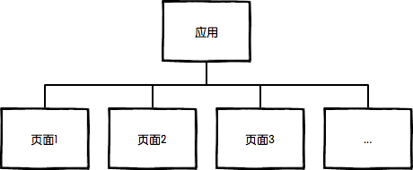
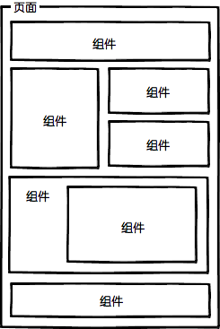
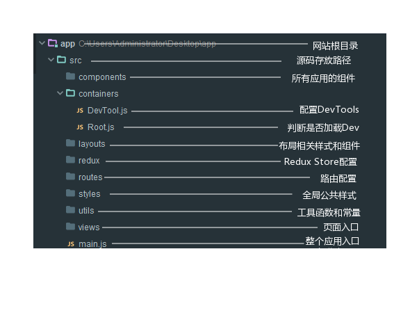

- 工程化要解决的问题：
    1. 设计前端的架构；
    2. 库/框架的选型；
    3. js/css模块化开发；
    4. 组件化开发；
    5. 静态资源智能化管理。

---

- 技术选型：

    |场景          |方案       |
    |:---|:---|
    |开发语言      |ES6 + Jsx(React)|
    |模块化CSS     |Sass/Less|
    |RemoteData    |FetchAPI|
    |Routing(路由) |react-router|
    |I18n          |gettext方案|
    |编译打包       |Babel+webpack|
    |Lint          |Eslint|
    |UT(单元测试)   |Mocha+chai+Sinon+Enzyme|
    |Demo Server   |Nodejs|

---

- JS/CSS模块化开发：

模块化最核心的价值在于解决不同文件之间的分工和调用问题，及依赖关系；
1. JS模块化方案：ES6 Module、AMD、CommonJS等；
2. CSS模块化方案：less、Sass、stylus等预处理器；

---

- 组件化开发：
    1. 页面上的每一个独立的可视/可交互的区域视为一个组件；
    2. 每个组件对应一个工程目录，组件所需要的静态资源就近维护；
    3. 组件具有独立性，组件之间自由组合；
    4. 页面杀死组件的容器，负责组合形成完整的界面；

    |名称|说明|举例|
    |:---|:---|:---|
    |JS模块   |独立的算法和数据单元   |浏览器环境检测(detect)，网络请求(ajax)，应用配置(config)，DOM操作(dom)，工具函数(utils)，以及组件里的JS单元|
    |CSS模块  |独立的样式单元         |栅格系统(grid)，字体图标(icon-fonts)，动画样式(animate)，以及组件里的CSS单元|
    |UI组件   |独立的可使/可交互单元  |页头(header)，页尾(footer)，导航栏(nav)，搜索框(search)|
    |页面     |UI组件的容器 	      |首页(index)，列表页(list)，用户管理(user)|

整个web应用由多个页面组成：

每个页面由多个组件组成：

大致源码目录：

---

- 静态资源管理

使用Webpack作为前端资源模块化管理和打包工具。Webpack把项目当作一个整体，通过给定的主文件（如：index.js），Webpack将从这个文件开始找到你的项目的所有依赖文件，使用loaders处理它们，最后打包为一个（或多个）浏览器可识别的JavaScript文件。