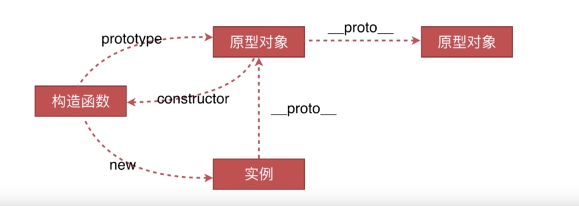
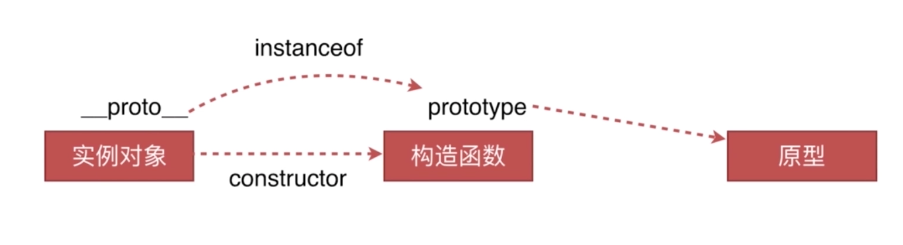

### 原型链

#### 创建对象有几种方法

- 字面量方式：
```js
var o1 = {name:'o1'};//Object{name:'o1'}
//第一个直接字面量，默认会将原型链指向object，所以把下面这个也归为字面量方式一类
var o11 = new Object({name:'o11'});//Object{name:'o11'}
```

- 使用显示的构造函数来创建对象
```js
var M = function(name){this.name=name;}
var o2 = new M('o2');//M{name:'o2'}
```

- Object.create()
```js
var P = {name:'o3'};
var o3 = Object.create(P);//Object{}
```

#### 原型、构造函数、实例、原型链

- 上例中，o1、o11、o2都叫实例；
- 被new使用的函数都是构造函数（所有函数都能被new，用new就是构造函数，没有用new就是普通函数），如上例中的M、Object；
- 声明一个函数时，自动会加上一个prototype属性，用来指向原型对象，这个属性会初始化一个空对象，就是原型对象；
- 原型对象通过constructor来区分被哪个构造函数所引用，即原型对象中的constructor会默认为声明的那个函数；
- 原型链：从一个实例对象往上找构造这个函数的相关联的对象（__proto__）；然后这个对象再往上找，它也有创造它的相关联的对象（prototype）；依次类推，一直到Object.prototype为止。
```js
var M = function(name){this.name=name;};
var o2 = new M('o2');

console.log(o2);//M{name:'name'}
console.log(M);//function(name){this.name=name;}
console.log(M.prototype);//Object{constructor:funcion}
console.log(M.prototype.constructor === M);//true
console.log(o2.__proto__ === M.prototype);//true
```
- 构造函数中增加了很多的属性和方法，当有多个实例的时候，想去共用这些方法的时候，不能每个实例都拷贝一份（会占内存），可以存在一个共同的东西上，这个共同的东西就是原型对象（实例可以通过prototype去找到原型链上所存在的方法）；
- 任何一个实例对象通过原型链找到它上面的原型对象，它上面的方法和属性都是被实例所共享的，这就是原型链的一个基本原理。
```js
var M = function(name){this.name=name;};
M.prototype.say = function(){console.log('say hi: '+this.name);};
var o2 = new M('o2');
var o4 = new M('o4');
o2.say();
o4.say();
```
- 在访问一个实例的方法/属性的时候，如果实例本身上没有找到该方法/属性；就会通过实例的__proto__找到它的上一级原型对象，看这个上面有没有这个方法/属性；如果上一级原型对象上也没有，会在原型对象的基础上，再通过这个原型的__proto__去找它上一级的原型对象；依次类推，直到找到Object.prototype还没有找到的话，原路返回，告诉这个这个方法/属性没有找到（未定义）；如果在中间的任意环节找到了，它就会停止查找，并返回这个方法/属性。

**总结**
1. 函数才有prototype，对象是没有prototype的。

2. 实例才有__proto__。
```js
M.__proto__ === Function.prototype; //true
//M这个普通函数是Function这一个构造函数的实例
```

3. 实例是被构造函数所生成的，实例是通过M.prototype和o2.__proto__来对原型对象产生关联的；如果修改了prototype，也就同时修改了实例的__proto__。



#### 原型链（instanceof）的原理

> instanceof运算符用于测试构造函数的prototype属性是否出现在对象的原型链中的任何位置

*构造函数的prototype属性也就是实例的__proto__*

- 实例对象的__proto_引用的是它的构造函数的原型对象（__proto__跟构造函数没什么关联，它关联的是构造函数的prototype所引用的原型对象）。

- instanceof的作用就是来判断__proto__和prototype是不是同一个引用。（原型对象上可能还会有原型链，--原型链也有__proto__）
```js
function Car(make, model, year) {
  this.make = make;
  this.model = model;
  this.year = year;
}
var auto = new Car('Honda', 'Accord', 1998);

console.log(auto instanceof Car);
// expected output: true

console.log(auto instanceof Object);
// expected output: true
//这里实际上等同于
console.log(auto.__proto__ === Car.prototype);//true
console.log(Car.prototype.__proto__ === Object.prototype);//true
```

- auto可以说是Car的实例，也可以说是Object的实例，如何判断auto到底是哪个构造函数new出来的呢？
```js
function Car(make, model, year) {
  this.make = make;
  this.model = model;
  this.year = year;
}
var auto = new Car('Honda', 'Accord', 1998);

console.log(auto.__proto__.constructor === Car);//true
console.log(auto.__proto__.constructor === Object);//false
```

*用__proto__.constructor来判断所属构造函数比用 instanceof 要严谨*



#### new运算符

实现过程：
1. 一个新对象被创建，它继承自foo.prototype；

    新对象可认为是空对象，它关联到foo.prototype，也就是构造函数的原型对象上。

2. 构造函数foo被执行（不执行也就是不new的话，构造函数内部所有与this相关的部分都会被指向window）。执行的时候，相应的参数会被传入，同时上下文（this）会被指定为这个新实例。new foo 等同于 new foo()，只能用于不传递任何参数的情况；

    把步骤1创建的新对象指定到构造函数的this上。

3. 如果构造函数返回了一个“对象”，那么这个对象会取代整个new出来的结果。如果构造函数没有返回对象，那么new出来的结果为步骤1创建的对象。

```js
//模拟new运算符
var new2 = function(func){
    //步骤1：创建空对象，空对象要关联构造函数的原型对象
    var o = Object.create(func.prototype);
    //步骤2：执行构造函数
    var k = func.call(o);
    console.log(k);//undefined
    console.log(typeof k);//'undefined'
    //步骤3：判断构造函数的运行结果是不是对象类型
    if(typeof k === 'object'){
        return k;
    }else{
        return o;
    }
}
//测试
function Car(make, model, year) {
  this.make = make;
  this.model = model;
  this.year = year;
}
var o5 = new2(Car);
console.log(o5 instanceof Car);//true
console.log(o5 instanceof Object);//true
console.log(o5.__proto__.constructor === Car);//true
console.log(o5.__proto__.constructor === Object);//false
```

- Object.create()返回空对象的原因
```js
var P = {name:'o3'};
var o3 = Object.create(P);//Object{}
```
这里Object.create()方法创建一个新对象，使用现有的对象（参数）来提供新创建的对象的__proto__即：
```js
o3.__proto__ === P;//true
```
所以，name属性是在o3的原型对象上的，o3本身还是一个空对象。

#### 参考资料

[Object.create](https://developer.mozilla.org/zh-CN/docs/Web/JavaScript/Reference/Global_Objects/Object/create)

[instanceof MDN](https://developer.mozilla.org/zh-CN/docs/Web/JavaScript/Reference/Operators/instanceof)