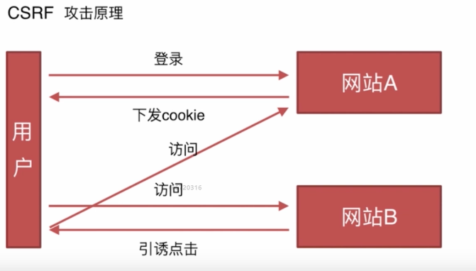

### 8.安全

#### CSRF

- 基本概念和缩写

    CSRF，通常称为跨站请求伪造，英文名 Cross-site request forgery缩写CSRF。

- 攻击原理

用户是网站A的注册用户，需要通过身份认证（过程：网站A核查身份是否正确，正确则下发cookie，这个cookie会被保存在用户的浏览器中。）登录这个网站。

接着用户又访问了网站B，网站B在下发网站页面的时候，会存在一个引诱点击。这个引诱点击往往是一个链接，指向的就是网站A的一个API接口（尤其这个API接口就是一个GET类型），访问A网站这个链接的时候浏览器会自动上传cookie，网站A这时通过了身份认证将会执行这个请求，引发一些意想不到的后果。

*重点是，用户要在网站A登录过；如果没登录过，网站A会提示用户进行登录。*

CSRF攻击成功的条件是：
1. 网站中某一个接口存在这种漏洞；
2. 用户在这个注册网站登录过。

- 防御措施
    1. Token验证；

        这个Token是用户注册成功以后（或者是没有但访问了这个网站），服务器会自动的向用户本地存储一个Token。在用户访问各种接口的时候，如果没有带这个Token的话，将不能通过验证。
        
        而CSRF只会在访问网站A的时候自动的上传cookie，没有手动的上传Token，所以将不会通过身份验证。

    2. Referer验证；

        Referer指的就是页面来源。服务器判断这个页面是不是当前站点下的页面，如果是的话就执行这个请求，如果不是一律拦截。

    3. 隐藏令牌

        跟Token很像，比如说会放在HTTP请求头中，不会放在链接上。

#### XSS

- 基本概念和缩写

    跨域脚本攻击：cross-site scripting。

- 攻击原理

    不需要用户做任何的登录认证，核心原理就是向页面注入脚本，比如在用户评论的提交区里写script标签，写img标签（上面加事件）。

- 防御措施

    宗旨：让插入的js不可执行。

- 对比XSS和CSRF的区别

    XSS是向页面注入js去运行，在js函数体里去做它想做的事情；

    CSRF是利用网站本身的漏洞去自动执行那些接口，并且CSRF依赖于用户要登录了网站。

[传送门](http://www.imocc.com/learn/812)
