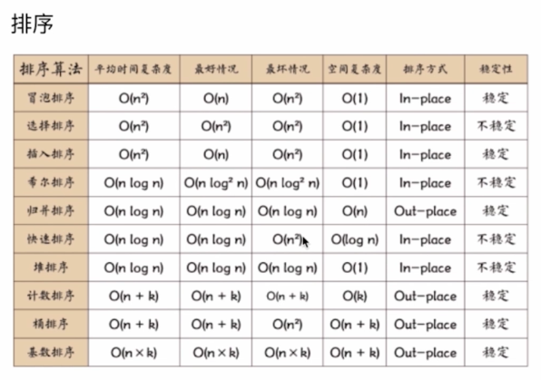

### 算法

#### 排序

写出代码并标明时间复杂度、空间复杂度



[快速排序](https://segmentfault.com/a/1190000009426421)

[选择排序](https://segmentfault.com/a/1190000009366805)

[希尔排序](https://segmentfault.com/a/1190000009461832)

冒泡排序

#### 堆栈、队列、链表

    堆栈必准备。

    js的数组本身就具备堆栈和队列的特性。
```js
//堆栈
Array.unshift()//进
Array.shift()//出
//队列
Array.push()//进
Array.shift()//出
```

[堆栈、队列、链表](http://juejin.im/entry/58759e79128fe1006b48cdfd)

#### 递归

60%的算法题会用到递归

[递归](https://segmentfault.com/a/1190000009857470)

#### 波兰式和逆波兰式

(1+3***5(4+6***3/6))用代码计算

[理论](http://www.cnblogs.com/chenying99/p/3675876.html)

[源码](https://github.com/Tairraos/rpn.js/blob/master/rpn.js)

#### 技巧

1. 列出的几个基本功要掌握；
2. 拿到题目先理解题目的意思，实在理解不了，可以问面试官要点提示；理解分析后，拿出一个解题思路；
3. 不会的可以写伪代码，思维逻辑上要正确。要分解步骤（比如条件怎么设，参数怎么传）；卡住了，比如知道要怎么做，但不会用哪个api，可以问面试官；
4. 不会波兰式或者其他算法，但是知道这道题的原理，可以把原理写清楚