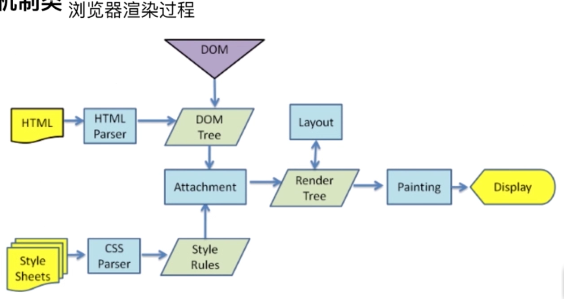
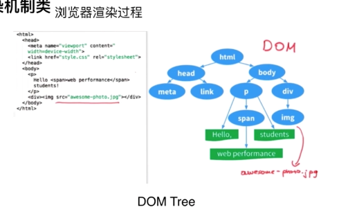
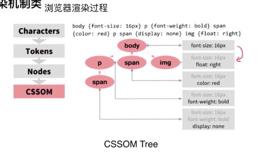
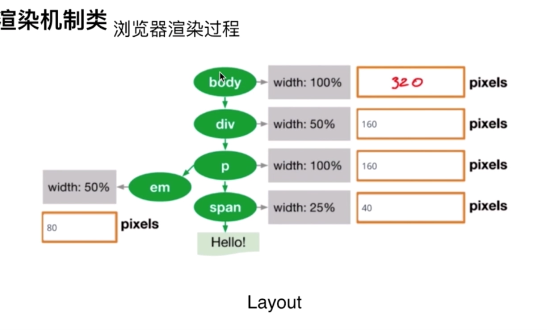

### 1.渲染机制

浏览器怎么渲染页面的。

#### 什么是DOCTYPE，及作用

> DTD（document type definition，文档类型定义）是一系列的语法规则，用来定义XML或(X)HTML的文件类型。浏览器会使用它来判断文档类型，决定使用何种协议来解析，以及切换浏览器模式。
> 
> DOCTYPE是用来声明文档类型和DTD规范的，一个主要的用途便是文件的合法性验证。如果文件代码不合法，那么浏览器解析时便会出一些差错。

(X)HTML、XML就是文档。

DTD就是告诉浏览器我是什么文档类型，浏览器根据这个来判断它用什么引擎来解析和渲染它。

DOCTYPE就是直接告诉浏览器什么是DTD，也就是说DOCTYPE通知浏览器告诉当前的文档包含的是哪个DTD（也就是哪个文档类型）。

- 常见的DOCTYPE有哪些？
    1. HTML5：
    ```html
    <!DOCTYPE html>
    ```
    2. 4.0.1 Strict（严格）
    ```html
    <!-->该DTD包含所有HTML元素和属性，但不包括展示性的和弃用的元素（如font）<-->
    <!DOCTYPE HTML PUBLIC "-//W3C//DTD HTML4.0.1//EN" "http://www.w3org/TR/html4/strict.dtd">
    ```
    3. 4.0.1 Transitional（过渡/传统）
    ```html
    <!-->该DTD包含所有的HTML元素和属性，包括展示性的和弃用的元素（如font）<-->
    <!DOCTYPE HTML PUBLIC "-//W3C//DTD HTML4.0.1 Transitional//EN" "http://www.w3.org/TR/html4/loose.dtd">
    ```

#### 浏览器渲染过程

浏览器渲染页面涉及HTML、CSS、JS三个内容，这三个都会影响页面的最后呈现形式。

步骤：
1. 拿到HTML后通过HTML解析器转成DOM Tree；
2. 拿到CSS后通过CSS解析器和Style Rules转成CSSOM Tree；
3. 然后两棵Tree结合生成Render Tree（可以告诉浏览器渲染的树的结构，但是它不包含HTML的具体内容，它也不知道这个位置是什么；也就是说，在Layout之前，它不知道Tree里的元素的具体位置），通过Layout可以精确的计算到要显示的这些DOM真正的位置，宽高等；
4. 然后通过Painting开始绘画页面，将页面呈现出来；
5. 最终浏览器看到页面的效果。










#### 重排Reflow

1. 定义

DOM结构中的各个元素都有自己的盒子（模型），这些都需要浏览器根据各种样式来计算并根据计算结果将元素放到它该出现的位置，这个过程称之为reflow。

每个DOM节点都不是固定的，js是修改DOM的，当修改后浏览器该怎么做，这就是重排。

2. 触发Reflow
    - 当增加、删除、修改DOM结点时，会导致Reflow或Repaint（因为有新的元素出现在屏幕上，所以肯定需要重绘）；
    - 当移动DOM的位置，或是搞个动画的时候；
    - 当修改CSS样式（width,heihgt,display:none,visibility:hidden）的时候；
    - 当Resize窗口的时候（移动端没有这个问题），或是滚动的时候有可能会引起重排；
    - 当修改网页的默认字体时。

3. 如何避免Reflow

#### 重绘Repaint

1. 定义

当各种盒子的位置、大小以及其他属性，例如颜色、字体大小等确定下来后，浏览器于是便把这些元素都按照各自的特性绘制了一遍，于是页面的内容出现了，这个过程称之为repaint。

页面要呈现的内容统统画在屏幕上，这就是repaint。

2. 触发Repaint
    - DOM改动；
    - CSS改动。

3. 如何避免最小长度的Repaint（如何尽量减少Repaint的频率）？
    - 一次性操作DOM节点，而不是一个一个的去操作DOM节点；

**重点：**Repaint是无法避免的，但是可以最大程度的降低Repaint；而Reflow是可以避免的。

#### 布局Layout（浏览器的布局方式）

Layout过程计算元素的位置信息，通常情况下浏览器的中下面的元素的布局不会影响到上面的元素的布局，所以Layout可以自上而下地进行。其坐标位置基于Frame，使用top和left来定位。

Layout的范围：

1. 全局

全局Layout会对整个RenderTree进行排版，触发全局Layout的行为如，浏览器窗口发生改变、网页字体改变等。

2. 局部

局部Layout只针对网页中的一部分内容进行排版，一般将这个区域叫做dirty rect。触发局部Layout的行为比较多，如Render节点被加入RenderTree、RenderTree中的某个节点发生改变。
Layout方式：
Layout过程是递归实现的
- 由Parent Render节点确定宽度
- 通过Parent Render找到每一个Child Render节点，计算每一个Child Render的高度
- 累加Child Render的高度得到最终的高度

#### 参考资料

> parser[par ser]：解析器
> 
> attachment[e ta CH ment]：附件
> 
> painting[pan tiNG]：绘画
