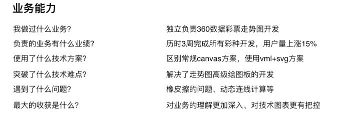

### 业务能力

主动描述 || 被动回答

1. 我做过什么业务？
2. 负责的业务有什么业绩？

    最好是能量化，比如说用户量变成了多少，性能提升了多少，收入增加了多少。总之，最好找到证明这个业绩的数据。

    *2018的年新增项目较往年多了6-7个。*

3. 使用了什么技术方案？

    用了什么东西？技术栈是什么？

4. 突破了什么技术难点？

    比如说别人做不到的你做到了。

    *项目部同事前端经验不足，要考虑他以后的维护和调整工作量，所以设计模式要做好，交接要处理好*

5. 遇到了什么问题？
6. 最大的收获是什么？

    经验的沉淀和积累，要能明确说出来--技术上得到了哪些成长，业务上得到了哪些总结

要是面试官不了解这个业务，可以问面试官，是否要打开这个网站给他看一下。